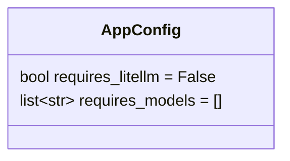
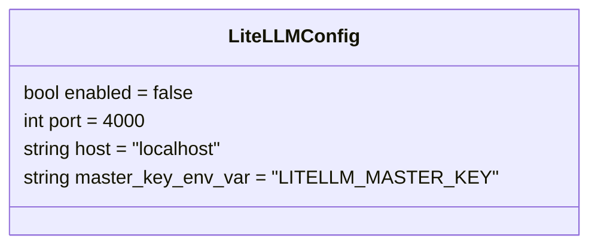
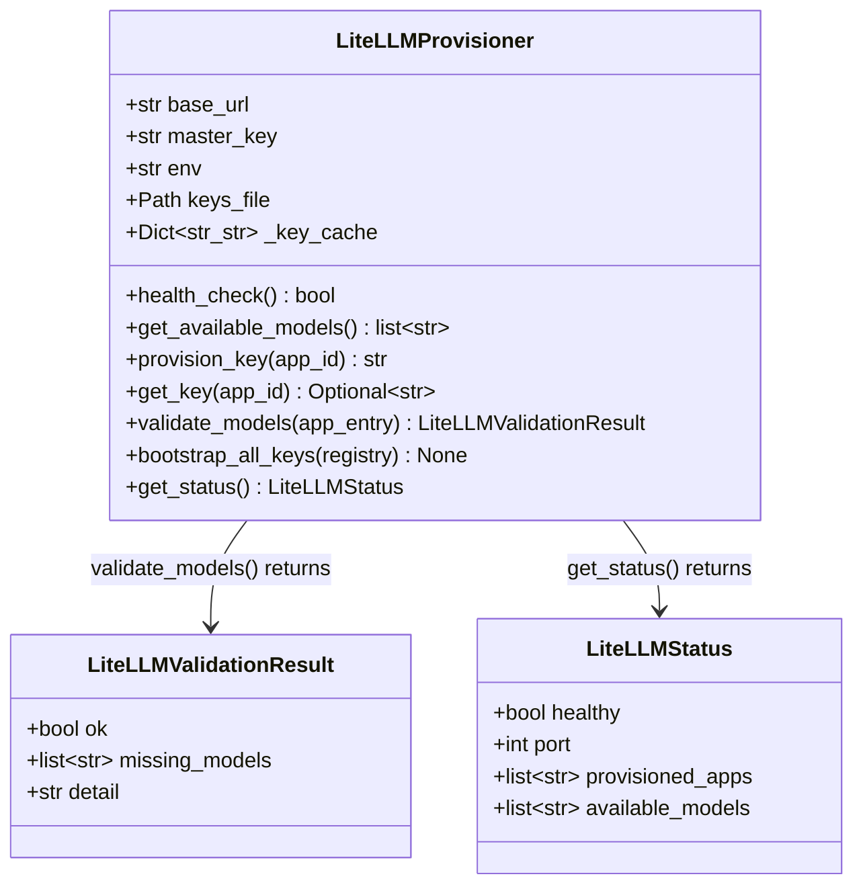
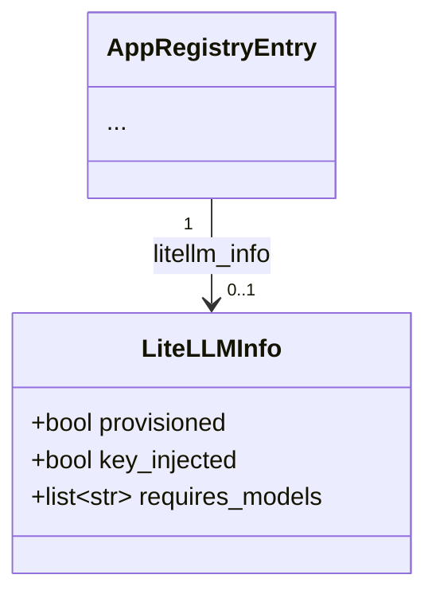

# P-0007: Data Model — Latarnia LiteLLM

## Manifest Extensions

New fields added to `AppConfig` (in `AppManifest.config`):



`requires_litellm: true` activates virtual key provisioning and environment injection.
`requires_models` declares the LiteLLM model aliases the app expects to be available. Validated at startup (refuse-to-start if any are missing from LiteLLM). Empty list = no model pre-flight check.
Declaring `requires_models` without `requires_litellm: true` is a `ValidationError`.

---

## Config Schema Extension

New `LiteLLMConfig` section in `config.json`:



`master_key_env_var`: the key name in `/opt/latarnia/{env}/litellm.env` that holds the LiteLLM admin master key. Read by `LiteLLMProvisioner` via `SecretManager` to authenticate admin API calls.

---

## LiteLLMProvisioner In-Memory + Persistent Model



---

## Registry Extension

`AppRegistryEntry` gains a new optional info block for LiteLLM, consistent with `DatabaseInfo` and `MCPInfo`:



`provisioned`: a virtual key was successfully created or verified via admin API.
`key_injected`: `LITELLM_BASE_URL` and `LITELLM_API_KEY` will be present in the app's environment at start.
`requires_models`: copied from the manifest (for inspection via `/api/apps`).

---

## File System Layout

New platform-managed files (per env):

```
/opt/latarnia/{env}/
├── litellm_config.yaml        # Model routing config (operator-managed).
│                              # Defines model_list aliases (e.g. claude-sonnet → anthropic/claude-sonnet-4-6).
│                              # LiteLLM reads this at startup.
├── litellm.env                # LiteLLM secrets: LITELLM_MASTER_KEY + provider API keys.
│                              # Mode 600. Operator-managed.
│                              # Referenced by latarnia-litellm-{env}.service EnvironmentFile=.
│                              # Also read by LiteLLMProvisioner via SecretManager for LITELLM_MASTER_KEY.
└── litellm_keys.json          # Latarnia's record of per-app virtual keys.
                               # Mode 600. Platform-managed (written by LiteLLMProvisioner).
                               # {"app_id": "sk-latarnia-{env}-app_id", ...}
```

### `litellm_keys.json` format

```json
{
  "example_full_app": "sk-latarnia-tst-example_full_app",
  "latarnik": "sk-latarnia-tst-latarnik"
}
```

---

## Port Additions to System Port Map

| Resource | TST | PRD |
|----------|-----|-----|
| LiteLLM AI Gateway | 4000 | 4001 |
