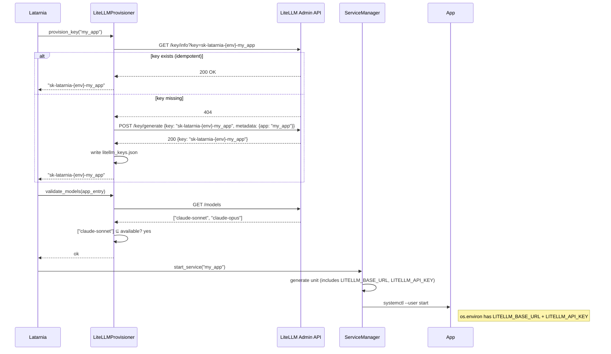
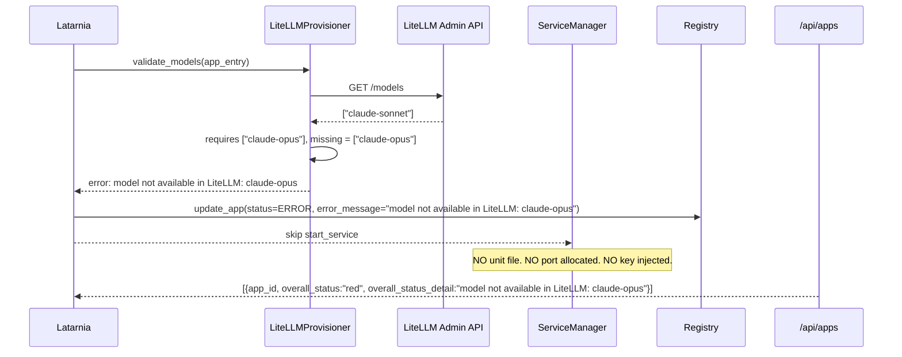
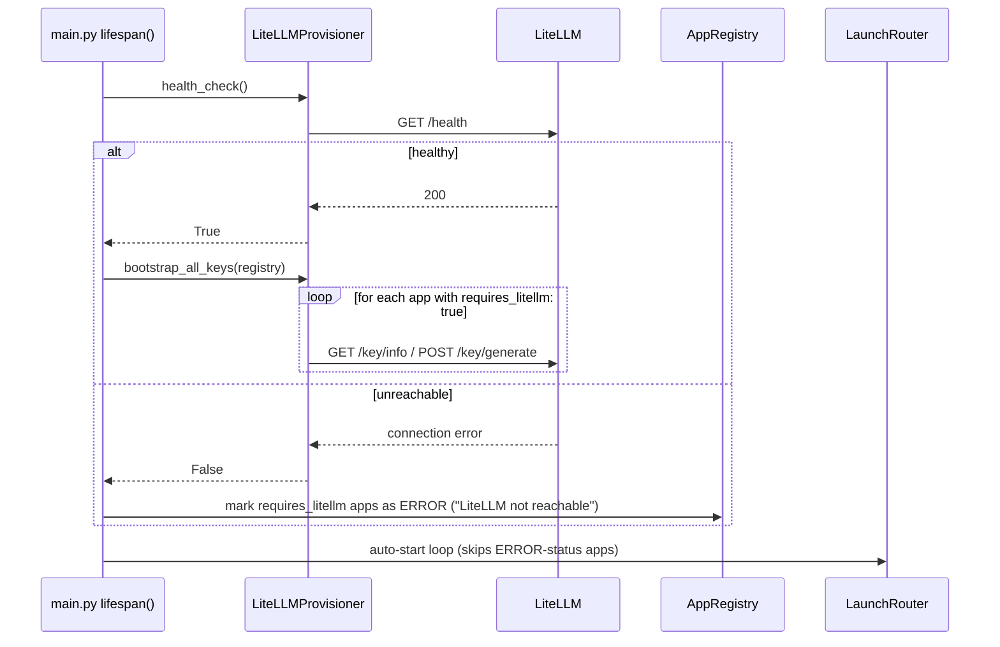
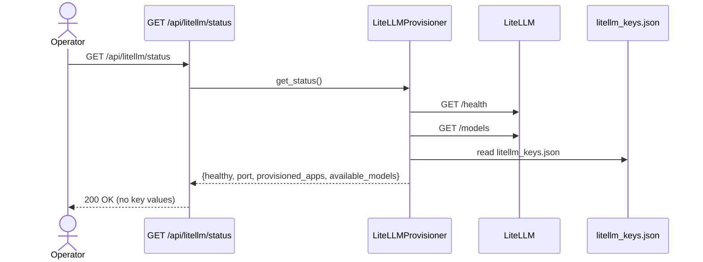

# P-0007: Latarnia LiteLLM — AI Gateway

## Problem

Apps that want to use AI (Claude, GPT-4, etc.) currently manage provider API keys themselves via `secrets.env`. This works but provides nothing above raw API access:

- No centralized spend tracking or per-app visibility
- Swapping a model or provider requires changing app code and config
- Every new AI app re-implements the same "read API key → call provider" plumbing
- No platform-level rate limiting or cost controls
- Apps see raw provider model names; if the model is retired the app breaks

As the number of AI-enabled apps grows (Latarnik already uses Anthropic + Voyage), this becomes an N-app coordination problem.

---

## Context & Constraints

- **Latarnia already manages per-app infrastructure as platform services**: Postgres (provisioned by `db_provisioner.py`), Redis (external service, consumed by all apps), secrets (managed by `secret_manager.py`). LiteLLM follows the same pattern — a shared infrastructure service that the platform provisions access to, not an app that happens to proxy AI calls.
- **Single-operator, high-trust environment.** All apps run as the same user on the same Pi. No need for multi-tenant isolation or key-guessing threat modelling.
- **`SecretManager` already exists (P-0006).** Provider API keys (e.g. `ANTHROPIC_API_KEY`) continue to live in `secrets.env`. LiteLLM reads them from its own environment; the platform does not re-route these secrets through the per-app injection flow for LiteLLM's own needs.
- **LiteLLM is a separate systemd service** (not a Latarnia app). It runs independently of the platform, like Redis. The platform healthchecks it at startup and provisions access to it per-app. Operator is responsible for bootstrapping the LiteLLM service unit (captured in the deployment skill).
- **Tech stack constraint**: Python 3.9+. LiteLLM client calls use the `httpx` async client (already a dependency).

---

## Proposed Solution (High-Level)

Introduce **Latarnia LiteLLM** (`latarnia-litellm-{env}.service`): a LiteLLM Proxy instance running as a platform-level systemd service alongside Redis and Postgres. The platform's new `LiteLLMProvisioner` component manages per-app access:

1. Apps declare `requires_litellm: true` and `requires_models: ["claude-sonnet"]` in `latarnia.json`.
2. At app registration/startup, `LiteLLMProvisioner` provisions a stable virtual key for the app via the LiteLLM admin API and persists it in `litellm_keys.json`.
3. Both launchers inject `LITELLM_BASE_URL` and `LITELLM_API_KEY` into the app's environment — same pattern as `DATABASE_URL`.
4. Before starting the app, the platform validates that all `requires_models` entries are available in LiteLLM and refuses-to-start if not.
5. If LiteLLM is unreachable at platform startup, apps that require it are deferred with a clear error.

Apps use the standard OpenAI-compatible Python client pointed at `LITELLM_BASE_URL`. No provider-specific code, no API key management — they just call the gateway.

### Main actors

- **Operator**: installs and configures `latarnia-litellm-{env}.service` (bootstrap). Manages `litellm_config.yaml` (model routing) and `litellm.env` (provider API keys + master key). No per-app config changes needed when adding a new model.
- **LiteLLMProvisioner** (new): provisions virtual keys, persists them, validates model availability, bootstraps keys on platform startup.
- **ServiceManager / SubprocessLauncher**: inject `LITELLM_BASE_URL` + `LITELLM_API_KEY` for apps with `requires_litellm: true`, same as existing `DATABASE_URL` injection.
- **App**: unchanged contract — it reads `LITELLM_BASE_URL` and `LITELLM_API_KEY` from `os.environ`. Uses the OpenAI-compatible client.

### Capabilities

- **cap-001: Manifest fields.** `AppConfig` gains `requires_litellm: bool = False` and `requires_models: list[str] = []`. Existing apps parse unchanged. Declaring `requires_models` without `requires_litellm: true` is a manifest validation error.
- **cap-002: `LiteLLMProvisioner` — virtual key management.** On app registration/startup, provisions a per-app virtual key (`sk-latarnia-{env}-{app_name}`) via LiteLLM admin API `/key/generate`. Uses `/key/info` first for idempotency. Persists the key in `/opt/latarnia/{env}/litellm_keys.json` (Latarnia's source of truth). On platform startup, bootstraps all registered apps' keys.
- **cap-003: Environment injection.** `LITELLM_BASE_URL=http://localhost:{port}` and `LITELLM_API_KEY=sk-latarnia-{env}-{app_name}` are injected into the app's environment. On Linux: `Environment=` lines in the generated systemd unit. On macOS: merged into `Popen(env=...)`.
- **cap-004: Model availability validation (refuse-to-start gate).** Before starting an app with `requires_models`, platform queries LiteLLM `GET /models` and validates each declared model exists. If any model is missing, the app is refused-to-start with `error_message = "model not available in LiteLLM: <name>"`. Same gate pattern as missing secrets (no port allocation, no unit file written).
- **cap-005: LiteLLM health gate at platform startup.** If any registered app has `requires_litellm: true` and LiteLLM is unreachable, those apps are not started and their status is set to `error` with message `"LiteLLM not reachable"`. Platform continues booting; other apps unaffected.
- **cap-006: `GET /api/litellm/status` endpoint.** Returns LiteLLM health, configured port, list of apps with provisioned keys (no key values), and available models. Returns a degraded response (not 500) if LiteLLM is unreachable.
- **cap-007: `example_full_app` exercises the feature.** `example_full_app/latarnia.json` declares `requires_litellm: true` and `requires_models: ["claude-sonnet"]`. This makes it the integration fixture for LiteLLM the same way it is for Postgres and secrets.

---

## Acceptance Criteria

- **cap-001:** `AppManifest.from_dict({"config": {"requires_litellm": true, "requires_models": ["claude-sonnet"]}})` parses correctly with `config.requires_litellm == True` and `config.requires_models == ["claude-sonnet"]`. `from_dict({"config": {}})` parses with defaults `False` and `[]`. `from_dict({"config": {"requires_models": ["claude-sonnet"]}})` (missing `requires_litellm: true`) raises `ValidationError`.
- **cap-002:** Given a running LiteLLM instance and app `my_app` with `requires_litellm: true`:
  - `LiteLLMProvisioner.provision_key("my_app")` calls `GET /key/info`, gets 404, calls `POST /key/generate` with `key="sk-latarnia-{env}-my_app"`, returns the key string.
  - Second call to `provision_key("my_app")` hits `GET /key/info`, gets 200, skips `POST /key/generate`, returns stored key.
  - `/opt/latarnia/{env}/litellm_keys.json` contains `{"my_app": "sk-latarnia-{env}-my_app"}` after the first call.
- **cap-003:** `ServiceManager.generate_service_template` for an app with `requires_litellm: true` produces a unit containing `Environment=LITELLM_BASE_URL=http://localhost:{port}` and `Environment=LITELLM_API_KEY=sk-latarnia-{env}-{app_name}`. `SubprocessLauncher.start_service` passes the same two env vars in `Popen(env=...)`. Verified via unit tests with mocked LiteLLM client.
- **cap-004:** App with `requires_models: ["claude-opus"]` and LiteLLM returning `models: ["claude-sonnet"]`: `start_service` returns `False`; no unit file written; no port allocated; `app.runtime_info.error_message` contains `"model not available in LiteLLM: claude-opus"`; `GET /api/apps` shows `overall_status: "red"`.
- **cap-005:** Platform startup with LiteLLM unreachable (connection refused): apps with `requires_litellm: true` are not started; `app.runtime_info.error_message` contains `"LiteLLM not reachable"`; other apps (without `requires_litellm: true`) start normally. Platform does not crash.
- **cap-006:** `GET /api/litellm/status` returns 200 with `{"healthy": true|false, "port": <int>, "provisioned_apps": ["app_id_1", ...], "available_models": ["claude-sonnet", ...]}`. `provisioned_apps` lists app IDs with a key in `litellm_keys.json`. `available_models` is empty list (not an error) when LiteLLM is unreachable. No key values appear anywhere in the response.
- **cap-007:** `example_full_app/latarnia.json` has `"requires_litellm": true` and `"requires_models": ["claude-sonnet"]`. On TST with LiteLLM running and `claude-sonnet` configured, `example_full_app` starts successfully and `LITELLM_BASE_URL` + `LITELLM_API_KEY` are present in its environment.

---

## Key Flows

### flow-01: App with `requires_litellm: true` starts (happy path)

### flow-02: Model missing (refuse-to-start)

### flow-03: Platform startup — LiteLLM health gate + key bootstrap

### flow-04: Operator queries LiteLLM status

---

## Technical Considerations

- **Module placement**: `src/latarnia/managers/litellm_provisioner.py`. Wired into `main.py` alongside `secret_manager`, `db_provisioner`. Injected into `ServiceManager.__init__` and `SubprocessLauncher.__init__` as optional kwarg (default `None` — when disabled, injection is skipped).
- **Virtual key format**: `sk-latarnia-{env}-{app_name}`. Deterministic and stable. Since `{app_name}` is the manifest `name` field (slugified, used as app_id), it's unique per env. Format includes env prefix so TST and PRD keys are distinct even if LiteLLM DB is shared (it isn't by default, but extra safety).
- **Key persistence**: `/opt/latarnia/{env}/litellm_keys.json`, platform-owned, mode 600. JSON object: `{"app_id": "sk-latarnia-{env}-app_id", ...}`. Written atomically on each new provisioning. Read on startup for bootstrap.
- **LiteLLM config file**: `/opt/latarnia/{env}/litellm_config.yaml` — operator-managed. Defines `model_list` with aliases (e.g. `claude-sonnet` → `anthropic/claude-sonnet-4-6`). Apps declare the alias, not the provider name. Model availability validation uses the alias names returned by LiteLLM `GET /models`.
- **LiteLLM secrets file**: `/opt/latarnia/{env}/litellm.env` — operator-managed, mode 600. Contains provider API keys (`ANTHROPIC_API_KEY`, etc.) and `LITELLM_MASTER_KEY`. The LiteLLM systemd unit references it via `EnvironmentFile=`. The Latarnia platform reads `LITELLM_MASTER_KEY` from this file (via `SecretManager.load()` applied to `litellm.env`) to authenticate admin API calls.
- **Idempotency**: `provision_key()` always calls `GET /key/info` first. If 200, uses stored key. If 404, generates. On LiteLLM restart (in-memory key loss), `bootstrap_all_keys()` re-provisions — the custom `key=` parameter ensures the same key string is issued each time, so apps already running with the old key get the same value on next start.
- **LiteLLM database (optional)**: If the operator sets `DATABASE_URL` in `litellm.env`, LiteLLM persists keys across restarts. For v1, this is optional. Without it, `bootstrap_all_keys()` on platform startup re-provisions all keys (cheap for O(10) apps). Document both modes in the deployment skill.
- **Config extension**: `config.json` gains a `litellm` section: `{"enabled": false, "port": 4000, "host": "localhost"}`. Env-scoped port (TST: 4000, PRD: 4001) is configured here, not derived. `LiteLLMConfig` is a new Pydantic model in the config schema.
- **HTTP client**: `LiteLLMProvisioner` uses `httpx.AsyncClient` for admin API calls (already a platform dependency). 5-second timeout. Master key sent as `Authorization: Bearer {key}` header.

---

## Risks, Rabbit Holes & Open Questions

- **Rabbit hole: do NOT build a model config UI.** Operator edits `litellm_config.yaml` directly. The platform doesn't manage model routing.
- **Rabbit hole: do NOT provision a Postgres database for LiteLLM in this scope.** LiteLLM's optional DATABASE_URL is fully operator-managed. `db_provisioner.py` is not touched.
- **Rabbit hole: do NOT implement per-app model restrictions.** Virtual keys are issued with access to all models in v1. Restricting keys to `requires_models` only is a v2 enhancement.
- **Rabbit hole: do NOT implement spend budgets or rate limits per app.** LiteLLM supports this; it's out of scope for v1.
- **Rabbit hole: do NOT add a LiteLLM dashboard panel.** `GET /api/litellm/status` provides the data; rendering it as a card is a future scope.
- **Risk: LiteLLM version compatibility.** The admin API (`/key/generate`, `/key/info`, `/models`) must be verified against the installed version. Pin the LiteLLM version in the platform venv requirements and document it.
- **Risk: `GET /models` returns a different format than expected.** LiteLLM's `/models` response is OpenAI-compatible (`{"data": [{"id": "claude-sonnet", ...}]}`). The validator must parse `data[*].id`, not just the top-level keys.
- **Risk: `provision_key` during high-load startup.** If 10+ apps all need LiteLLM and `bootstrap_all_keys()` runs synchronously, startup could be slow. For v1 this is acceptable (10 apps × ~50ms = ~500ms). Parallelise with `asyncio.gather` if it becomes an issue.
- **Open question**: should `requires_litellm: true` without `requires_models` be valid (inject the gateway URL but skip model validation)? **v1 answer: yes — `requires_models` is optional.** An app that wants the gateway URL but doesn't declare specific model requirements gets `LITELLM_BASE_URL` + `LITELLM_API_KEY` with no pre-flight model check.

---

## Scope: IN vs OUT

### IN scope (v1)

- Manifest fields `requires_litellm` and `requires_models` (cap-001)
- `LiteLLMProvisioner` with virtual key provisioning, persistence, and startup bootstrap (cap-002)
- `LITELLM_BASE_URL` + `LITELLM_API_KEY` injection in both launchers (cap-003)
- Model availability validation gate (refuse-to-start) (cap-004)
- LiteLLM health gate at platform startup (cap-005)
- `GET /api/litellm/status` endpoint (cap-006)
- `example_full_app` declares `requires_litellm: true` (cap-007)
- `config.json` `litellm` section with port + host
- Deployment skill updates: bootstrap steps for LiteLLM systemd unit, `litellm_config.yaml`, `litellm.env`
- Documentation updates: `app-specification.md`, `architecture.md`, `dataModel.md`, `SYSTEM.md`

### OUT of scope (v2 or later)

- **Per-app model restrictions** — virtual keys issued with full model access in v1
- **Spend budgets / rate limits** per app
- **LiteLLM Postgres DB provisioning** via platform — operator-managed only
- **Dashboard UI panel** for LiteLLM status
- **Model config management** via Latarnia API — operator edits `litellm_config.yaml` directly
- **Auto-restart of apps when LiteLLM comes back online** — manual restart only
- **LiteLLM cluster / multi-host** — single instance per env
- **Streamlit app support for `requires_litellm`** — service apps only in v1; Streamlit TTL lifecycle doesn't have the same pre-start gate

### Cut list (drop in this order if scope shrinks)

1. **`GET /api/litellm/status` (cap-006)** — operator uses LiteLLM's own UI/API directly
2. **Model availability validation gate (cap-004)** — degrade to warning log at startup; let app start and fail at runtime
3. **`example_full_app` LiteLLM fixture (cap-007)** — integration coverage deferred
