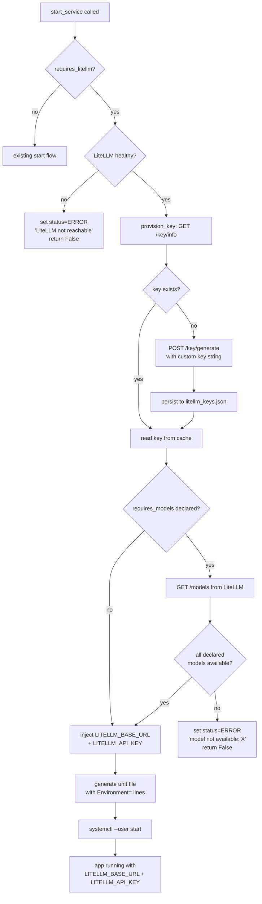
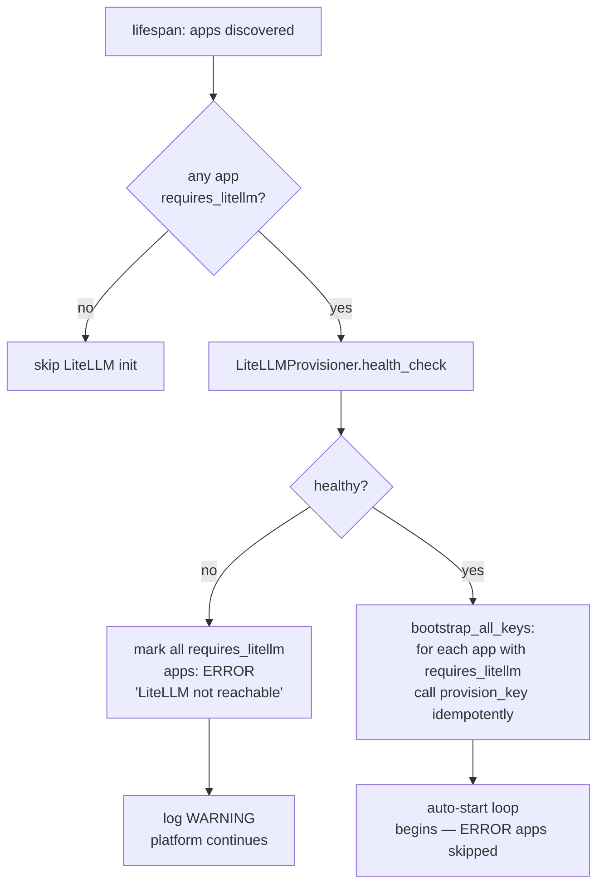
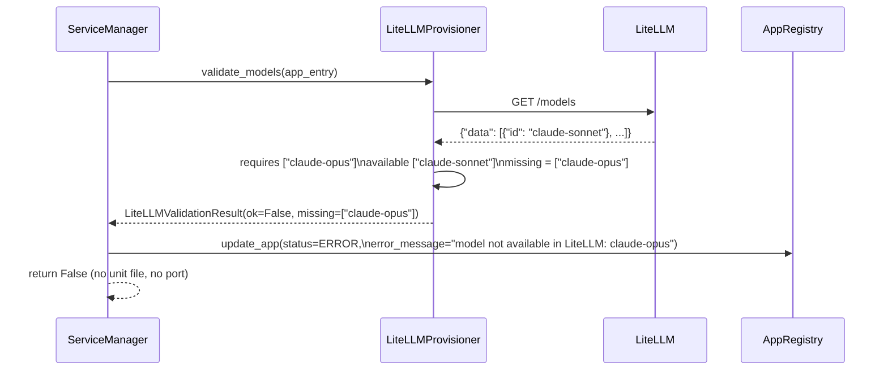

# P-0007: Workflows — Latarnia LiteLLM

## flow-01: App startup with `requires_litellm: true` (Linux/systemd)

Covers cap-002 (key provisioning), cap-003 (injection), cap-004 (model validation).



## flow-02: Platform startup — LiteLLM bootstrap (cap-005)

Runs in `main.py` lifespan, after app discovery and before the auto-start loop.



## flow-03: Operator adds a new model to LiteLLM

No platform changes required. App declares the new model alias in its manifest.

```mermaid
sequenceDiagram
    actor Op as Operator
    participant Config as litellm_config.yaml
    participant LLM as LiteLLM service
    participant App as App manifest

    Op->>Config: add new model_list entry\n(e.g. claude-opus)
    Op->>LLM: systemctl restart latarnia-litellm-{env}
    Note over LLM: new model now available at GET /models
    Op->>App: add "claude-opus" to requires_models
    Op->>Op: restart app via dashboard
    Note over App: model validation passes;\napp starts with LiteLLM access
```

## flow-04: Virtual key lifecycle

```mermaid
sequenceDiagram
    participant Prov as LiteLLMProvisioner
    participant FS as litellm_keys.json
    participant LLM as LiteLLM Admin API

    Note over Prov: First registration (app not in keys.json)
    Prov->>LLM: GET /key/info?key=sk-latarnia-{env}-my_app
    LLM-->>Prov: 404
    Prov->>LLM: POST /key/generate\n{key: "sk-latarnia-{env}-my_app",\n metadata: {app: "my_app", env: "{env}"}}
    LLM-->>Prov: 200 {key: "sk-latarnia-{env}-my_app"}
    Prov->>FS: write {"my_app": "sk-latarnia-{env}-my_app"}

    Note over Prov: Subsequent startups (idempotent)
    Prov->>LLM: GET /key/info?key=sk-latarnia-{env}-my_app
    LLM-->>Prov: 200 (key exists in LiteLLM)
    Note over Prov: no POST needed; key unchanged

    Note over Prov: LiteLLM restarted (in-memory key lost, no DATABASE_URL)
    Prov->>LLM: GET /key/info?key=sk-latarnia-{env}-my_app
    LLM-->>Prov: 404 (memory cleared)
    Prov->>LLM: POST /key/generate\n{key: "sk-latarnia-{env}-my_app", ...}
    LLM-->>Prov: 200 {key: "sk-latarnia-{env}-my_app"}
    Note over Prov: same deterministic key string re-issued;\napps already running are unaffected
```

## flow-05: Model validation gate (refuse-to-start)

Covers cap-004.


