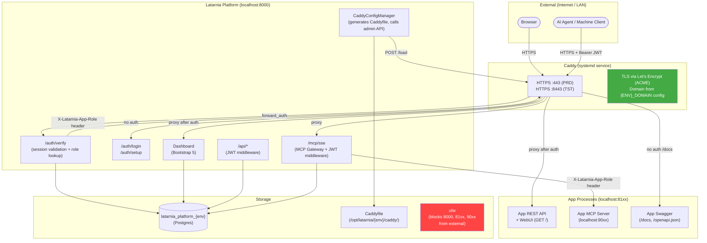
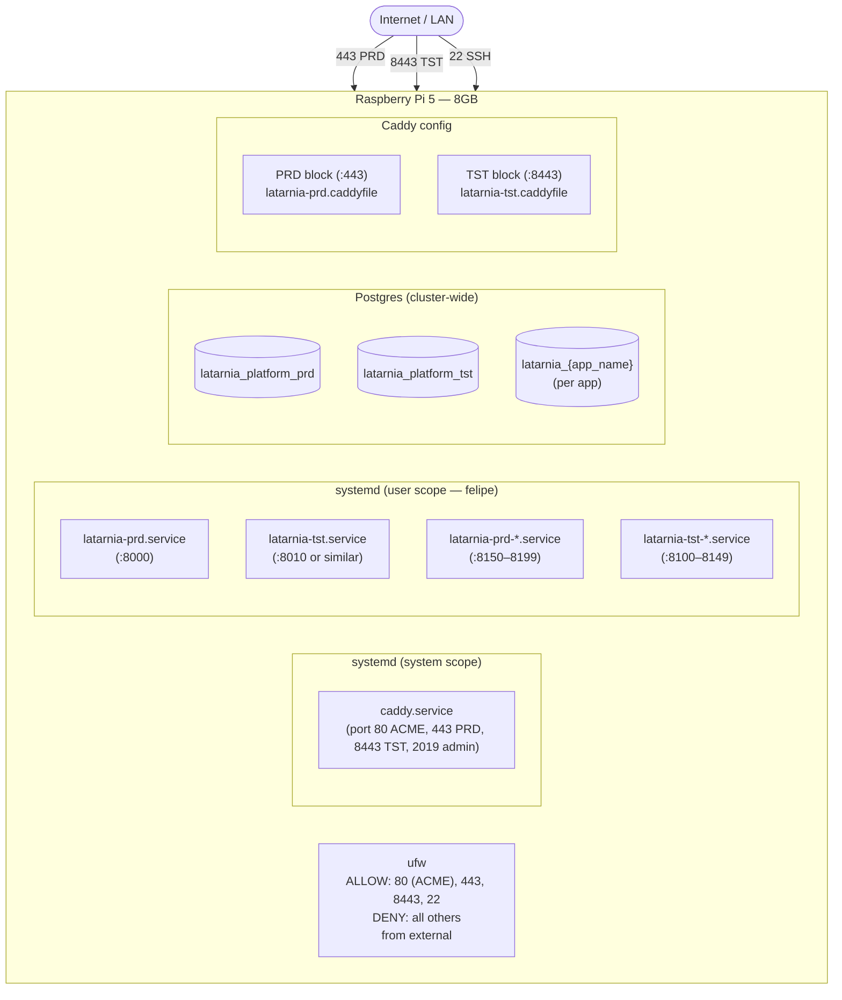
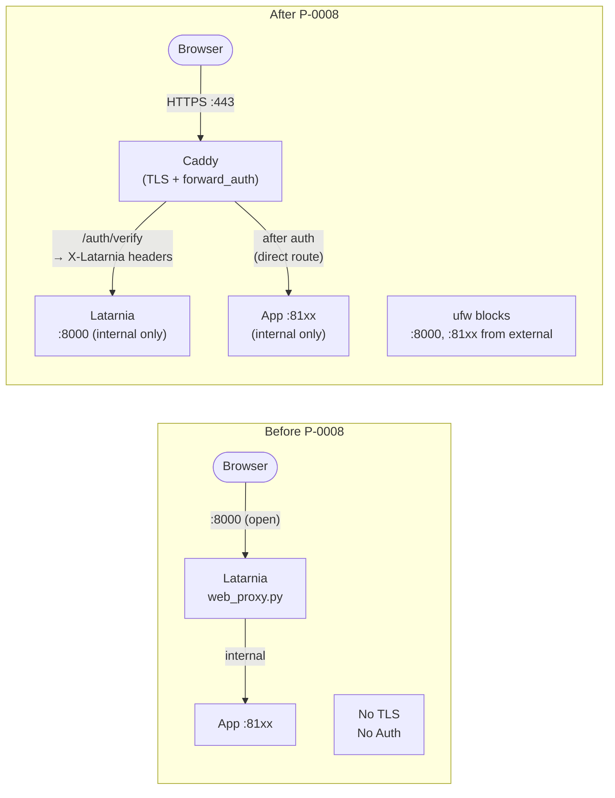
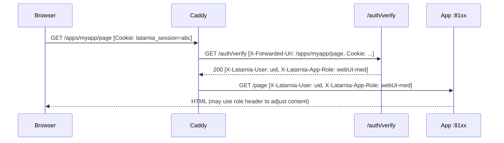

# P-0008: Architecture

## Component Architecture (After P-0008)



## Deployment Topology



## Before vs After: Proxy Architecture



## Data Flow: Authenticated WebUI Request



## Caddyfile Structure (Generated)

Each Latarnia environment generates its own include file. Main Caddyfile imports both.

```
# /etc/caddy/Caddyfile (manually configured)
import /opt/latarnia/prd/caddy/latarnia.caddyfile
import /opt/latarnia/tst/caddy/latarnia.caddyfile

# /opt/latarnia/prd/caddy/latarnia.caddyfile (generated by Latarnia PRD)
# Site address uses PRD_DOMAIN from config (e.g. home.stanham.com).
# No tls directive — Caddy auto-provisions Let's Encrypt for real domains,
# self-signed for localhost (dev). Port 80 must be reachable for ACME HTTP-01.
home.stanham.com:443 {

    # Public: auth endpoints
    handle /auth/* {
        reverse_proxy localhost:8000
    }

    # Public: Latarnia swagger
    handle /docs* {
        reverse_proxy localhost:8000
    }
    handle /openapi.json {
        reverse_proxy localhost:8000
    }

    # Public: per-app swagger (generated per registered app)
    handle /apps/my_app/docs* {
        reverse_proxy localhost:8151
    }
    handle /apps/my_app/openapi.json {
        reverse_proxy localhost:8151
    }

    # Protected: per-app webUI (generated per registered app)
    handle /apps/my_app/* {
        forward_auth localhost:8000 {
            uri /auth/verify
            copy_headers X-Latarnia-User X-Latarnia-App-Role X-Latarnia-Is-Super
        }
        reverse_proxy localhost:8151
    }

    # Protected: everything else (dashboard, API, MCP)
    handle /* {
        forward_auth localhost:8000 {
            uri /auth/verify
            copy_headers X-Latarnia-User X-Latarnia-App-Role X-Latarnia-Is-Super
        }
        reverse_proxy localhost:8000
    }
}
```

> **Note:** MCP (`/mcp/*`) is routed under the catch-all and reaches Latarnia's MCP gateway. Caddy's `forward_auth` validates the session cookie path for browser-based MCP; machine clients bypass Caddy's `forward_auth` by sending a Bearer token that Latarnia's gateway validates internally.

## New Latarnia Modules

| Module | Path | Responsibility |
|---|---|---|
| `auth.db` | `src/latarnia/auth/db.py` | Platform DB init, migration runner |
| `auth.providers.base` | `src/latarnia/auth/providers/base.py` | `AuthProvider` Protocol — `setup_credentials`, `validate`, `get_setup_form_spec` |
| `auth.providers.totp` | `src/latarnia/auth/providers/totp.py` | TOTP implementation of `AuthProvider` — secret gen, AES-GCM encryption, code validation |
| `auth.sessions` | `src/latarnia/auth/sessions.py` | Session create/validate/expire |
| `auth.roles` | `src/latarnia/auth/roles.py` | Role lookup, assignment, enforcement |
| `auth.users` | `src/latarnia/auth/users.py` | User CRUD — create (with setup token), list, deactivate |
| `auth.jwt` | `src/latarnia/auth/jwt.py` | JWT sign, validate, revocation check |
| `auth.routes` | `src/latarnia/auth/routes.py` | `/auth/*` and `/api/auth/*` FastAPI router |
| `auth.middleware` | `src/latarnia/auth/middleware.py` | JWT Bearer middleware for `/api/*` and `/mcp/*` |
| `caddy.manager` | `src/latarnia/caddy/manager.py` | Caddyfile generation and reload |

## Deleted Components

| Component | Reason |
|---|---|
| `src/latarnia/managers/web_proxy.py` | Replaced by Caddy |
| `WebProxyManager` references in `main.py` | No longer needed |
