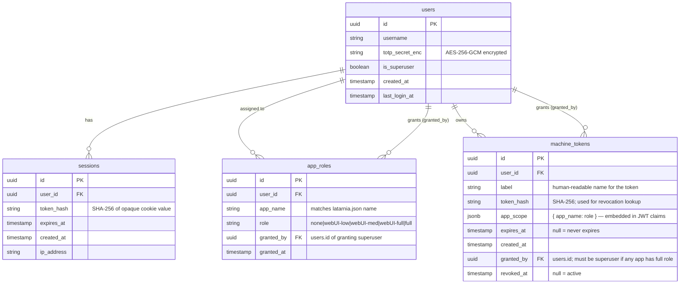

# P-0008: Data Model

All entities live in `latarnia_platform_{env}` (e.g., `latarnia_platform_prd`, `latarnia_platform_tst`).
This DB is created by Latarnia at startup using the platform's admin Postgres credentials.

## Entity Relationship Diagram



## Field Notes

### `users`
- V1 supports a single user. Schema is designed for multiple users but `POST /api/auth/users` is superuser-only and out of scope for V1 UI (future).
- `totp_secret_enc`: the raw TOTP secret (base32, 20 bytes) encrypted with AES-256-GCM. Key comes from `LATARNIA_TOTP_ENC_KEY` in `secrets.env`. Nonce prepended to ciphertext.
- `is_superuser`: true for the initial setup user; can be granted to additional users by an existing superuser.

### `sessions`
- Cookie value is a random UUID (v4). The UUID is never stored — only its SHA-256 hash is in the DB.
- `expires_at` is checked on every `/auth/verify` call. Expired rows are cleaned up at login time (lazy GC).
- Session TTL is configurable in Latarnia config (default: 8 hours).

### `app_roles`
- One row per (user, app). Upsert on assignment.
- `app_name` is the value from the app's `latarnia.json` `name` field — the same string used in the Latarnia registry.
- When an app is deregistered, its `app_roles` rows are retained (so the assignment is preserved on re-registration).
- Default effective role for any (user, app) pair with no row: `none`.

### `machine_tokens`
- The JWT issued to the client contains: `sub` (user_id), `iat`, `exp`, `apps` (copy of `app_scope`), `super` (bool from user record).
- `token_hash` is SHA-256 of the raw JWT string, used for revocation lookup on each API call (DB lookup per request — acceptable on Pi scale).
- If `revoked_at` is non-null, the token is rejected even if the JWT signature is valid and not expired.
- `granted_by` must be a superuser if any app in `app_scope` has role `full`.

## Role Enum

```
none       → no access; tile hidden in dashboard
webUI-low  → webUI access at low permission level; MCP access at low level
webUI-med  → webUI access at medium level; MCP access at medium level
webUI-full → webUI access at full level; MCP access at full level
full       → webUI (full) + MCP (full) + REST API access
```

- `full` is the only role that grants REST API access.
- `webUI-*` roles grant webUI and MCP at the matching level; no REST API.
- Superuser is a user attribute, not a per-app role — it grants `full` access to all apps and the ability to manage users and tokens.

## Migrations

Platform auth migrations live in `src/latarnia/auth/migrations/` and are applied at Latarnia startup:

```
src/latarnia/auth/migrations/
├── 001_create_users.sql
├── 002_create_sessions.sql
├── 003_create_app_roles.sql
└── 004_create_machine_tokens.sql
```

Applied via a simple sequential runner (no external migration tool). A `schema_versions` table in `latarnia_platform_{env}` tracks applied migrations by filename + checksum, matching the pattern used by `db_provisioner.py` for app DBs.
