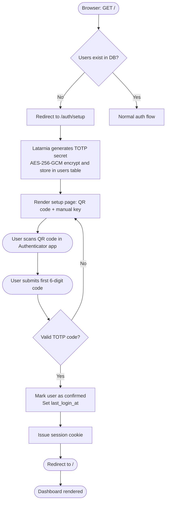
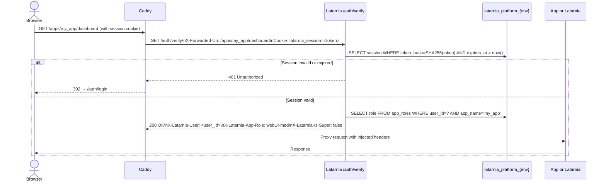
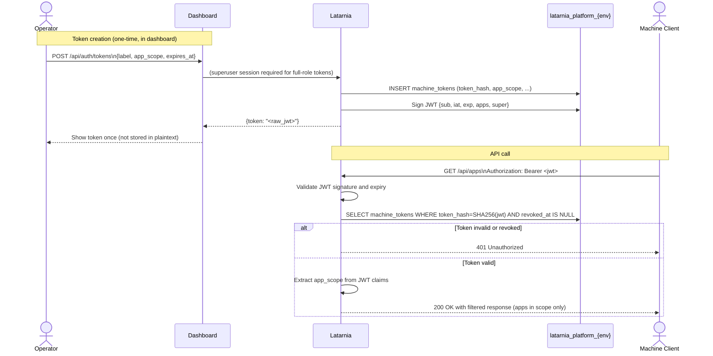
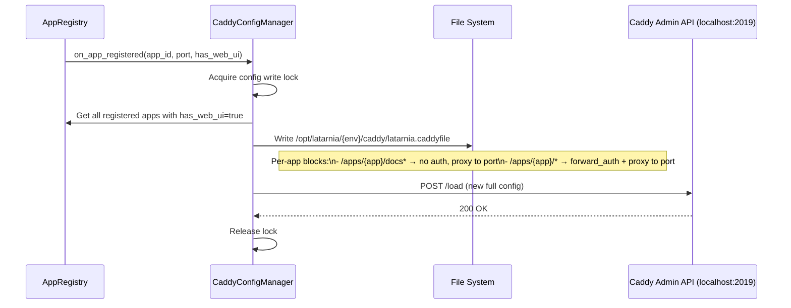
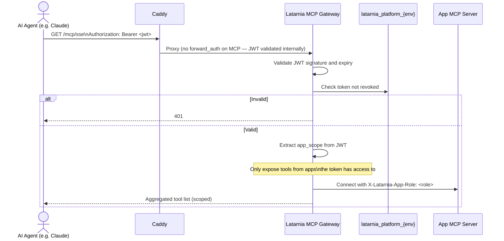

# P-0008: Workflows

## flow-01: First-Run TOTP Setup [cap-009, cap-013]

First visit to any protected route when no users exist in `latarnia_platform_{env}`.



## flow-02: TOTP Login [cap-010, cap-011]

Normal login flow after initial setup.

```mermaid
flowchart TD
    A([Browser: GET protected route]) --> B{Valid session cookie?}
    B -- Yes --> C[/auth/verify proceeds]
    B -- No --> D[Caddy redirects to /auth/login]
    D --> E([User enters 6-digit TOTP code])
    E --> F{Code valid & not replayed?}
    F -- No --> G[Return error message]
    G --> E
    F -- Yes --> H[Generate random UUID session token\nStore SHA-256 hash in sessions table\nSet expires_at = now + TTL]
    H --> I[Set latarnia_session cookie\nHTTP-only, Secure, SameSite=Strict]
    I --> J([Redirect to original destination])
```

## flow-03: Caddy forward_auth with Role Injection [cap-004, cap-012, cap-015, cap-016]

Every request to a protected route goes through this flow.



## flow-04: JWT Machine Token Issuance and API Call [cap-019, cap-020]

Machine clients (scripts, AI agents) authenticate with a long-lived JWT.



## flow-05: App Registration → Caddy Config Reload [cap-002, cap-007]

When an app with `has_web_ui: true` is registered or deregistered.



## flow-06: MCP Authentication [cap-021]

AI agent connecting to the MCP gateway.


