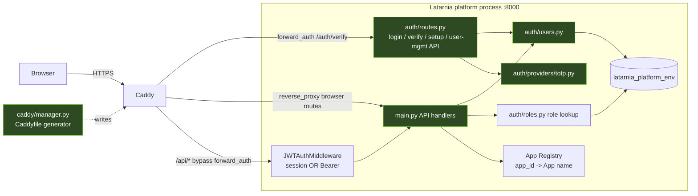

# P-0010 Architecture

P-0010 adds no components. It modifies four existing surfaces of the P-0008 auth
stack. This document shows where each capability lands and how identity reaches
the enforcement points.

## Component map (changed surfaces highlighted)



**Changed modules**
- `caddy/manager.py` — cap-002: emit `next={http.request.orig_uri}` in the
  `forward_auth` redirect (both the catch-all and per-App blocks).
- `auth/routes.py` — cap-002 (`safe_next` hardening in login); cap-006/007/008
  (new user-management endpoints); cap-008 re-enrollment reuses existing
  `/auth/setup`.
- `main.py` — cap-001 (`GET /` redirect); cap-003/004 (`require_superuser`
  guard on `/api/system/restart`, `/api/logs/latarnia`); cap-005 (filter in
  `/api/activity/recent`).
- `auth/users.py` — cap-006 `delete_user` (+ guards); cap-007 `reactivate_user`;
  cap-008 `reissue_setup_token` (delete credential + sessions, set token).
- `auth/providers/totp.py` — cap-008 credential rotation (delete existing TOTP
  credential so `ensure_credentials` mints a fresh secret).
- `templates/dashboard.html` — cap-003/004 hide controls for non-Superusers;
  cap-006/007/008 add delete / reactivate / re-issue controls in Users & Roles.
- `auth/migrations/006_granted_by_set_null.sql` — data model (see data_model.md).

## Identity → enforcement

```mermaid
flowchart TD
    subgraph BrowserRoutes [Browser routes: / and /apps/name/*]
        A1[Caddy forward_auth] --> A2[/auth/verify injects\nX-Latarnia-User / -App-Role / -Is-Super/]
        A2 --> A3[dashboard route resolves session user\nfor render-time hiding cap-003/004]
    end

    subgraph ApiRoutes [/api/* routes]
        B1[JWTAuthMiddleware\n valid session OR Bearer] --> B2[handler]
        B2 --> B3[require_superuser:\n session -> resolve_session_user.is_superuser\n Bearer -> claims.super]
        B3 --> B4[403 if not super cap-003/004]
        B2 --> B5[activity filter uses\n role_lookup + Registry cap-005]
    end
```

**Key rule:** UI hiding (cap-003/004 dashboard) is convenience; the authoritative
check is the server-side `require_superuser` 403. Both are implemented (defense in
depth). The activity filter (cap-005) is server-side only — the client receives a
list already scoped to what the user may see.

## Deployment topology (unchanged)

Single Raspberry Pi 5, `tst` and `prd` side-by-side under `/opt/latarnia/{env}/`.
Caddy is the only ingress (`:443` prd, `:8443` tst). The auth DB
`latarnia_platform_{env}` runs in the shared Postgres cluster. P-0010 ships via
the normal flow (scope branches → `dev` → `tst` → `prd`); migration 006 is
applied automatically by `AuthDB` on the next platform start after deploy. No new
ports, services, or external systems.

## External interactions (unchanged)

- Authenticator apps (TOTP) — client side only; the platform stores the encrypted
  secret. cap-008 rotates it.
- No new outbound calls. Setup links are delivered out of band by the operator.
