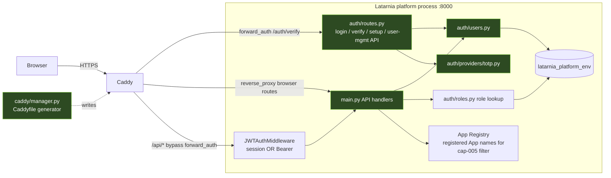

# P-0010 Architecture

P-0010 adds no components. It modifies four existing surfaces of the P-0008 auth
stack. This document shows where each capability lands and how identity reaches
the enforcement points.

## Component map (changed surfaces highlighted)



**Changed modules**
- `caddy/manager.py` — cap-002: emit `next={http.request.orig_uri}` in the
  `forward_auth` redirect (both the catch-all and per-App blocks).
- `auth/routes.py` — cap-002 (`safe_next` hardening in login); cap-003/004
  (extract the existing `_require_superuser` from the router-factory closure and
  extend it for Bearer `jwt_claims["super"]`); cap-006/007/008 (new
  user-management endpoints; deactivate moves from `DELETE …/{id}` to
  `POST …/{id}/deactivate`); cap-008 re-enrollment reuses existing `/auth/setup`.
- `main.py` — cap-001 (`GET /` redirect, replacing the JSON probe); cap-003/004
  (shared `_require_superuser` guard on `/api/system/restart`,
  `/api/logs/latarnia`); cap-005 (default-deny filter in `/api/activity/recent`;
  Superuser-only gate on `/ws/activity`).
- `web/dashboard.py` — cap-003/004: resolve the session user via
  `resolve_session_user` and pass `is_superuser` into the template context
  (today the route passes only `env`).
- `auth/users.py` — cap-006 `delete_user` (+ guards); cap-007 `reactivate_user`;
  cap-008 `reissue_setup_token` (delete credential + sessions, revoke tokens,
  set token); deactivate gains machine-token revocation.
- `auth/tokens.py` — cap-006/008: `revoke_all_for_user(user_id)` (sets
  `revoked_at = NOW()` on the user's live tokens). Middleware unchanged — it
  already rejects revoked/missing rows.
- `auth/providers/totp.py` — cap-008 credential rotation (delete existing TOTP
  credential so `ensure_credentials` mints a fresh secret).
- `templates/dashboard.html` — cap-003/004 Jinja-hide the Restart + Latarnia
  Logs header buttons and logs modal for non-Superusers; cap-005 open the
  activity WebSocket only for Superusers; cap-006/007/008 add delete /
  reactivate / re-issue controls in Users & Roles and point `deactivateUser()`
  at the new `POST …/deactivate` route.
- `tests/integration/test_auth_flow.py` — deactivation assertions move to the
  new route in the same commit.
- `auth/migrations/006_granted_by_set_null.sql` — data model (see data_model.md).

## Identity → enforcement

```mermaid
flowchart TD
    subgraph BrowserRoutes [Browser routes: / and /apps/name/*]
        A1[Caddy forward_auth] --> A2[/auth/verify injects\nX-Latarnia-User / -App-Role / -Is-Super\nfor APPS only — never trusted by the platform/]
        A2 --> A3[dashboard route resolves session user\nvia resolve_session_user from the cookie\nfor render-time hiding cap-003/004]
    end

    subgraph ApiRoutes [/api/* routes]
        B1[JWTAuthMiddleware\n valid session OR Bearer] --> B2[handler]
        B2 --> B3[_require_superuser shared helper:\n session -> resolve_session_user.is_superuser\n Bearer -> state.jwt_claims.super]
        B3 --> B4[403 if not super cap-003/004]
        B2 --> B5[activity filter: default-deny\n source must equal a registered App name\n + get_role == full cap-005]
    end

    subgraph WsRoute [/ws/activity]
        C1[WS connect] --> C2[resolve session user from cookie]
        C2 --> C3[close if not Superuser cap-005]
    end
```

**Key rules:**
- UI hiding (cap-003/004 dashboard) is convenience; the authoritative check is
  the server-side `_require_superuser` 403. Both are implemented (defense in
  depth). There is exactly **one** superuser helper — the existing one in
  `auth/routes.py`, extracted and extended — never a second parallel check.
- The platform never trusts `X-Latarnia-*` request headers for its own
  decisions; they exist for proxied Apps. The dashboard conditional comes from
  `resolve_session_user`, which also works in dev where no Caddy is in front.
- The activity filter (cap-005) is server-side only and default-deny — the
  client receives a list already scoped to what the user may see; the live
  WebSocket is Superuser-only.

## Deployment topology (unchanged)

Single Raspberry Pi 5, `tst` and `prd` side-by-side under `/opt/latarnia/{env}/`.
Caddy is the only ingress (`:443` prd, `:8443` tst). The auth DB
`latarnia_platform_{env}` runs in the shared Postgres cluster. P-0010 ships via
the normal flow (scope branches → `dev` → `tst` → `prd`); migration 006 is
applied automatically by `AuthDB` on the next platform start after deploy. No new
ports, services, or external systems.

## External interactions (unchanged)

- Authenticator apps (TOTP) — client side only; the platform stores the encrypted
  secret. cap-008 rotates it.
- No new outbound calls. Setup links are delivered out of band by the operator.
