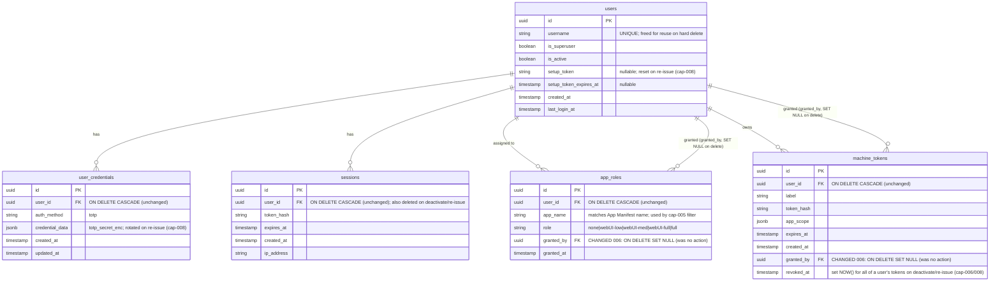

# P-0010 Data Model

P-0010 makes **one** schema change to the P-0008 platform auth database
(`latarnia_platform_{env}`): migration `006` relaxes the two `granted_by`
foreign keys so a granter can be hard-deleted without taking down the rows they
granted to other users. No new tables, no new columns.

## Affected tables (unchanged columns shown for context)



## Migration 006 — `006_granted_by_set_null.sql`

Intent: when a user is hard-deleted (cap-006), rows where they appear as
`granted_by` must survive with `granted_by = NULL` rather than blocking the
delete or cascading away another user's access.

Operations (drop + re-add each FK with the new action):

```sql
ALTER TABLE app_roles      DROP CONSTRAINT app_roles_granted_by_fkey;
ALTER TABLE app_roles      ADD  CONSTRAINT app_roles_granted_by_fkey
    FOREIGN KEY (granted_by) REFERENCES users(id) ON DELETE SET NULL;

ALTER TABLE machine_tokens DROP CONSTRAINT machine_tokens_granted_by_fkey;
ALTER TABLE machine_tokens ADD  CONSTRAINT machine_tokens_granted_by_fkey
    FOREIGN KEY (granted_by) REFERENCES users(id) ON DELETE SET NULL;
```

> Confirm the actual auto-generated constraint names on the Pi
> (`\d app_roles`) before finalizing — Postgres names them
> `<table>_<column>_fkey` by default, which the migration assumes. The migration
> is applied by the existing sequential runner + `schema_versions` tracking in
> `AuthDB`.

## Delete semantics summary (cap-006)

| Relationship | On `DELETE users WHERE id = X` |
|---|---|
| `user_credentials.user_id = X` | CASCADE (rows removed) |
| `sessions.user_id = X` | CASCADE (rows removed) |
| `app_roles.user_id = X` | CASCADE (rows removed) |
| `machine_tokens.user_id = X` | CASCADE (rows removed — tokens stop validating) |
| `app_roles.granted_by = X` | **SET NULL** (row kept, attribution cleared) |
| `machine_tokens.granted_by = X` | **SET NULL** (row kept, attribution cleared) |

Guards (enforced in application code, not the schema):
- Refuse if `X` is the requesting user (no self-delete).
- Refuse if `X` is the only `is_active = TRUE AND is_superuser = TRUE` user.

JWT consequence of delete: `JWTAuthMiddleware` requires a live `machine_tokens`
row (`tokens.py is_active`), so the cascade alone invalidates the deleted user's
JWTs — no extra revocation step needed for delete.

## Machine-token revocation (cap-006 deactivate / cap-008 re-issue)

No schema change — uses the existing `revoked_at` column:

```sql
UPDATE machine_tokens SET revoked_at = NOW()
WHERE user_id = %s AND revoked_at IS NULL;
```

Called by deactivate (`POST /api/auth/users/{id}/deactivate`) and re-issue
(`POST /api/auth/users/{id}/setup-token`). Reactivation (cap-007) does **not**
clear `revoked_at` — revoked tokens stay dead; new ones are issued normally.

## No-change confirmations

- No change to `users`, `user_credentials`, `sessions` columns or constraints.
- cap-007 (reactivate) and cap-008 (re-issue) operate via UPDATE/DELETE on
  existing columns (`is_active`, `setup_token`, `setup_token_expires_at`,
  `user_credentials`, `machine_tokens.revoked_at`), requiring no schema change.
- `docs/System/dataModel.md` must be updated post-implementation to note the
  `ON DELETE SET NULL` on both `granted_by` columns.
