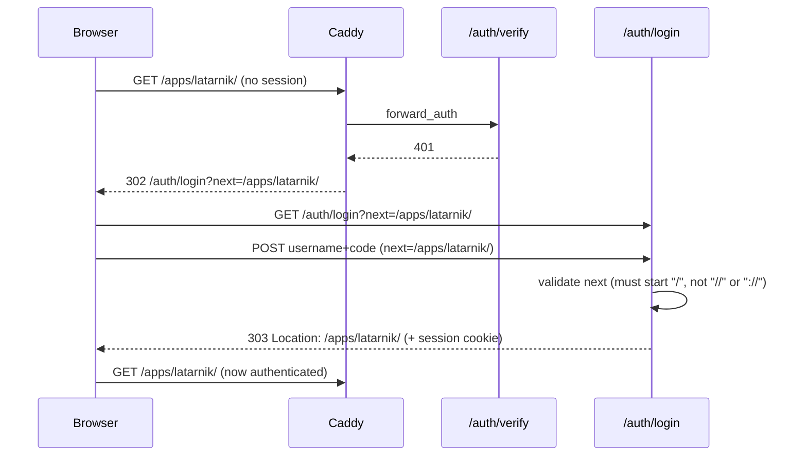
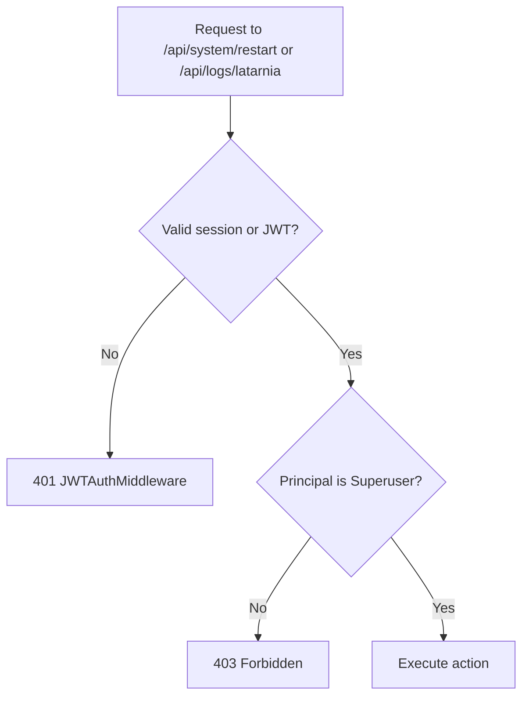
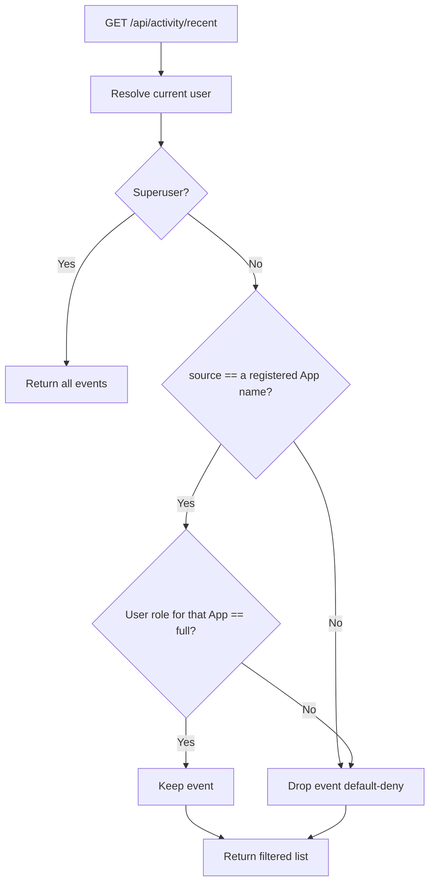
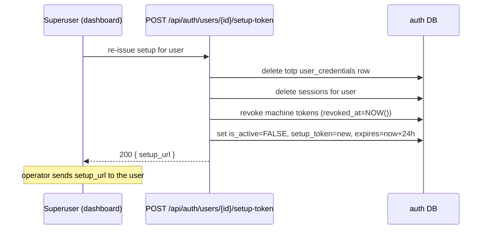

# Problem

P-0008 shipped Caddy + Auth (TOTP login, per-App roles, JWT machine tokens) and
is live on `tst`. Validation surfaced a set of authorization gaps and UX defects
that must be closed before the platform is promoted to `prd`:

- Unauthenticated and post-login navigation is wrong: the root path does not land
  on the dashboard, and after logging in the user is dropped on `/` instead of
  the page they originally requested.
- The `/api/*` gate only checks that *a* valid session/token exists — it does not
  enforce Superuser for platform-level actions. Any logged-in user can restart
  the platform and read the platform's own logs.
- The dashboard "recent activity" feed shows every App's events to every user,
  leaking activity for Apps the user has no role on — both via
  `GET /api/activity/recent` and via the live `/ws/activity` WebSocket, which is
  not gated at all inside the platform.
- Operator user-management is incomplete: a user can only be deactivated (never
  deleted), cannot be re-activated, and there is no way to re-issue a TOTP
  enrollment link when a user misses the window or changes phones.
- Deactivation revokes sessions but **not** machine tokens: a deactivated user's
  JWT (including one with `super: true` and no expiry) keeps working, because
  token validation checks only `machine_tokens.revoked_at`
  (`tokens.py is_active`), never `users.is_active`.

**Who is affected:** the platform operator (Superuser) and every non-Superuser
user. **Why it matters:** these are authorization-correctness issues on the
ingress path; they must be right before `prd` exposes the platform publicly.

Origin: follow-up to P-0008 (Caddy + Auth, `[DONE]`). No origin pitch — promoted
directly from an operator fix list during the P-0008 `tst` rollout.

# Context & Constraints

- **Builds on P-0008.** All work is within the existing `auth/` module, the Caddy
  config generator, the platform API in `main.py`, and the dashboard templates.
  No new external service, no new component.
- **Auth identity propagation (current state):**
  - Browser routes (`/`, `/apps/{name}/*`) are gated by Caddy `forward_auth` →
    `/auth/verify`, which injects `X-Latarnia-User`, `X-Latarnia-App-Role`,
    `X-Latarnia-Is-Super` onto the proxied request.
  - `/api/*` and `/mcp/*` bypass `forward_auth` (T-0002) and are gated inside the
    platform by `JWTAuthMiddleware`, which accepts a Bearer JWT **or** a valid
    session cookie. The middleware confirms a valid principal exists but does
    **not** enforce role/Superuser — per-endpoint checks are required.
  - Handlers resolve the current user from the session cookie via the existing
    `resolve_session_user` helper; JWT callers carry a `super` claim.
- **Data model:** the platform auth DB `latarnia_platform_{env}` owns `users`,
  `user_credentials`, `sessions`, `app_roles`, `machine_tokens`. All child tables
  cascade on `users.id` delete **except** `app_roles.granted_by` and
  `machine_tokens.granted_by`, which reference `users(id)` with no cascade.
- **Role model (from P-0008):** `none | webUI-low | webUI-med | webUI-full | full`.
  `full` is the only App role granting REST API access. `is_superuser` is
  orthogonal and grants everything. **"admin" in this spec means `is_superuser`.**
- **Glossary note:** P-0008 introduced auth vocabulary (Superuser, App Role,
  Machine Token, Session, Setup Token) that is used in the data model and code but
  not yet recorded in `docs/System/glossary.md`. This spec uses those terms; they
  should be added via the `glossary` skill (flagged as a follow-up, not part of
  this project's scope).

# Proposed Solution (High-Level)

Close the gaps with four independent slices. Main actors: **Superuser** (the
operator) and **User** (any non-Superuser principal with one or more App roles).

- **cap-001 — Root redirect.** An authenticated `GET /` returns `302 → /dashboard`.
- **cap-002 — Post-login return-to-URL.** After a successful login the user is
  returned to the URL they originally requested (full original path, including the
  `/apps/{name}/` prefix), not `/`. The `next` parameter is hardened against
  open-redirect.
- **cap-003 — Restart is Superuser-only.** `POST /api/system/restart` returns
  `403` for non-Superusers; the dashboard hides the restart control for them.
- **cap-004 — Platform logs are Superuser-only.** `GET /api/logs/latarnia` returns
  `403` for non-Superusers; the dashboard hides the platform-logs panel for them.
- **cap-005 — Activity feed role-filtered.** `GET /api/activity/recent` returns,
  for a non-Superuser, only events whose `source` resolves to a registered App
  name the user holds the `full` role on. Everything else — platform events,
  unrecognized sources, raw stream names — is dropped (**default-deny**). A
  Superuser sees all events. The live `/ws/activity` WebSocket becomes
  **Superuser-only** (rejected at connect); non-Superusers get the filtered REST
  list on refresh, consistent with the platform's manual-refresh pattern.
  Deliberate product decision: only the `full` role sees an App's events —
  `webUI-*` holders see the App card but not its activity.
- **cap-006 — Hard-delete a user.** A Superuser can permanently delete a user.
  Self-delete and deleting the last active Superuser are refused. The user's own
  `user_credentials`, `sessions`, `app_roles`, `machine_tokens` are removed
  (cascade — and because token validation requires a `machine_tokens` row, the
  deleted user's JWTs are rejected immediately); rows where the deleted user is
  `granted_by` are preserved with `granted_by` set to NULL (migration 006).
  **Route migration:** `DELETE /api/auth/users/{id}` currently performs
  *deactivation*. That behavior moves to `POST /api/auth/users/{id}/deactivate`
  (same scope, same commit), and `DELETE` becomes hard-delete. Deactivation
  additionally gains machine-token revocation (see cap-008 rationale).
- **cap-007 — Re-activate a user.** A Superuser can re-activate a deactivated user
  who still holds valid credentials, without re-enrollment. Reactivation does
  **not** un-revoke machine tokens — the user (or operator) issues new ones.
- **cap-008 — Re-issue TOTP setup.** A Superuser can re-issue a user's authenticator
  enrollment link. This deactivates the user, kills their sessions, **revokes all
  their machine tokens** (`revoked_at = NOW()`), deletes their existing TOTP
  credential (so a fresh secret is generated), and mints a new single-use
  `setup_token`. The user re-enrolls at `/auth/setup?token=…`.

# Acceptance Criteria

### cap-001 — Root redirect
- **root_redirects_authenticated:** authenticated `GET /` (valid session cookie) → `302` with `Location: /dashboard`.
- **root_unauth_still_login:** unauthenticated `GET /` (no cookie, browser `Accept`) → `302 → /auth/login` (Caddy forward_auth, unchanged).

### cap-002 — Post-login return-to-URL
- **login_returns_to_app_path:** unauthenticated browser GET `/apps/latarnik/` → redirected to `/auth/login?next=/apps/latarnik/`; after valid `POST /auth/login` with that `next` → `303` with `Location: /apps/latarnik/`.
- **login_default_dashboard:** valid `POST /auth/login` with no `next` → `303` with `Location: /dashboard`.
- **login_rejects_open_redirect:** `POST /auth/login` with `next=//evil.com` (or `next=https://evil.com` or `next=/\evil.com`) → login succeeds but redirect target falls back to `/dashboard` (never an off-site host).
- **caddy_emits_orig_uri:** generated Caddyfile `forward_auth` redirect uses `next={http.request.orig_uri}`; `caddy validate` accepts it.

### cap-003 — Restart is Superuser-only
- **restart_forbidden_for_user:** `POST /api/system/restart` with a non-Superuser session/JWT → `403`.
- **restart_allowed_for_super:** `POST /api/system/restart` with a Superuser session/JWT → `200` (restart scheduled) on Linux.
- **restart_button_hidden:** dashboard rendered for a non-Superuser contains no restart control; for a Superuser it does.

### cap-004 — Platform logs are Superuser-only
- **platform_logs_forbidden_for_user:** `GET /api/logs/latarnia` with a non-Superuser → `403`.
- **platform_logs_allowed_for_super:** `GET /api/logs/latarnia` with a Superuser → `200` with log lines.
- **platform_logs_panel_hidden:** dashboard rendered for a non-Superuser does not show the platform-logs panel; for a Superuser it does.

### cap-005 — Activity feed role-filtered
- **activity_filtered_for_user:** given recent events with sources `latarnik` (user role = `full`) and `other_app` (user role = `none`), `GET /api/activity/recent` as that user returns only `latarnik` events.
- **activity_default_deny_for_user:** an event whose `source` does not resolve to a registered App name (e.g. `system`, a raw stream-name suffix like `example.events.created`, or an unknown string) is absent from a non-Superuser's `GET /api/activity/recent`.
- **activity_full_for_super:** `GET /api/activity/recent` as a Superuser returns all events including unresolvable sources and apps the Superuser has no explicit role on.
- **activity_ws_superuser_only:** a non-Superuser's WebSocket connect to `/ws/activity` is refused/closed before any event is delivered; a Superuser's connect succeeds and receives events.

### cap-006 — Hard-delete a user
- **delete_removes_user_and_children:** Superuser `DELETE /api/auth/users/{id}` on an active non-Superuser → `200`; the `users` row and its `user_credentials`/`sessions`/`app_roles`/`machine_tokens` rows are gone.
- **delete_rejects_machine_tokens:** a JWT issued to the deleted user is rejected (`401`) after the delete (its `machine_tokens` row is gone; `is_active` lookup fails).
- **delete_preserves_granted_rows:** if the deleted user had granted an `app_role` to another user, that role row survives with `granted_by = NULL`.
- **delete_self_forbidden:** Superuser `DELETE /api/auth/users/{own_id}` → `409` (or `403`); the row remains.
- **delete_last_superuser_forbidden:** `DELETE` of the only active Superuser → `409`; the row remains.
- **deactivate_moved_route:** `POST /api/auth/users/{id}/deactivate` deactivates (Superuser-only; `is_active = FALSE`, sessions deleted, machine tokens revoked); the old deactivate-via-`DELETE` semantics no longer exist. Dashboard Deactivate button and existing integration tests use the new route.

### cap-007 — Re-activate a user
- **reactivate_user:** Superuser `POST /api/auth/users/{id}/activate` on a deactivated user that has a TOTP credential → `200`; `is_active` becomes `TRUE`; the user can log in with their existing authenticator.
- **reactivate_requires_credential:** `POST /api/auth/users/{id}/activate` on a user with no `user_credentials` row → `409` with a message to re-issue setup instead.
- **reactivate_keeps_tokens_revoked:** reactivation does not clear `revoked_at` on the user's machine tokens; a token revoked by deactivate/re-issue stays rejected.

### cap-008 — Re-issue TOTP setup
- **reissue_returns_setup_url:** Superuser `POST /api/auth/users/{id}/setup-token` → `200` with a `setup_url` of the form `/auth/setup?token=<token>`; the user's `setup_token`/`setup_token_expires_at` are set, `is_active` becomes `FALSE`, their `sessions` are deleted, and their existing `totp` `user_credentials` row is removed.
- **reissue_revokes_machine_tokens:** after re-issue, all the user's machine tokens have `revoked_at` set; a previously-issued JWT for that user → `401`.
- **reissue_then_enroll_new_secret:** completing `POST /auth/setup?token=<token>` with a valid code generates a NEW TOTP secret (distinct credential row) and re-activates the user.
- **reissue_invalidates_old_device:** after re-issue and before re-enrollment, a code from the user's old authenticator fails login (credential rotated/removed).

# Key Flows

### flow-01 — Unauthenticated deep-link → login → return (cap-002)

### flow-02 — Superuser-gated platform action (cap-003, cap-004)

### flow-03 — Activity feed filtering (cap-005)

### flow-04 — Re-issue TOTP setup (cap-008)

# Technical Considerations

- **High-level approach:** small, additive changes to existing modules. A new
  migration `006` adjusts the two `granted_by` FKs to `ON DELETE SET NULL`. New
  API endpoints live in `auth/routes.py`; platform-action guards live in
  `main.py`; UI changes are conditionals in `templates/dashboard.html` driven by
  the current user's `is_superuser`.
- **Identity on `/api/*` — extend, don't duplicate:** a session-only
  `_require_superuser(request)` **already exists** inside the router factory in
  `auth/routes.py` (~line 132) and gates the user-management endpoints. Do NOT
  write a second helper. Extract it to module level (or a small shared module) so
  `main.py` can import it, and extend it to accept Bearer callers via
  `request.state.jwt_claims["super"]` (set by `JWTAuthMiddleware`); session
  callers resolve via `resolve_session_user(...)["is_superuser"]` as today. One
  helper, both principals, raises `HTTPException(403)`.
- **Root route (cap-001):** `GET /` in `main.py` (~line 449) currently returns a
  JSON probe `{"message": "Latarnia is running", ...}`. Replace it with the
  redirect — `/health` remains the liveness probe. Check for and update any test
  or script asserting on the old JSON body (none found in `tests/unit/` at spec
  time, but re-verify at implementation).
- **Caddy `orig_uri` (cap-002):** `handle_path` strips the matched prefix before
  `{http.request.uri.path}` is read, so the app-path `next` collapses to `/`.
  `{http.request.orig_uri}` carries the pre-rewrite URI. Validate with
  `caddy validate` on the Pi (we have SSH + Caddy there) before relying on it.
  **Known limitation:** `orig_uri` includes the original query string and Caddy's
  `redir` does not URL-encode placeholder values, so a deep link that itself has
  a query (`/apps/x/page?a=b`) degrades to `next=/apps/x/page` with `a=b` parsed
  as a sibling param. Accepted for now — `safe_next` must tolerate `?` in
  otherwise-safe values; do not try to fix encoding inside Caddy.
- **Open-redirect hardening (cap-002):** the current `next.startswith("/")`
  check admits `//host` and `/\host`. Tighten to: must start with a single `/`,
  must not start with `//` or `/\`, must not contain `://`.
- **Activity source model (cap-005) — verified against code:** an event's
  `source` is whatever the publishing App set in its `XADD` (convention: the
  manifest App name, e.g. `example_full_app`), falling back to the stream-name
  suffix when absent (`event_subscriber.py` `_handle_message`). There is no
  platform publisher emitting `source = system`/`service_manager` today, and no
  `app_id` in events. Therefore the filter is **default-deny keyed on App
  name**: keep an event iff `source` equals a registered App's name (App
  Registry) AND the user's role for that name is `full` (`roles.py get_role`);
  drop everything else. No `app_id → name` mapping is needed. **Honesty note:**
  `source` is publisher-controlled — any App with Redis access can claim another
  App's name — so this filter is a privacy convenience, not a security boundary
  between Apps. Acceptable at current scale; recorded here deliberately.
- **WebSocket gating (cap-005):** `/ws/activity` currently has no in-app auth and
  broadcasts all events. Gate it at connect: resolve the session user from the
  cookie; if not a Superuser, close the connection (e.g. code 4403 / policy
  violation) before any event is sent. Update the dashboard JS to open the WS
  only when the page is rendered for a Superuser.
- **Machine-token revocation (cap-006/008):** `JWTAuthMiddleware` already rejects
  tokens whose `machine_tokens` row is missing or has `revoked_at` set
  (`tokens.py is_active`) — no middleware change needed. Add a
  `revoke_all_for_user(user_id)` (`UPDATE machine_tokens SET revoked_at = NOW()
  WHERE user_id = %s AND revoked_at IS NULL`) and call it from deactivate and
  re-issue. Hard-delete needs nothing extra: the cascade removes the rows.
- **Deactivate route migration (cap-006):** `DELETE /api/auth/users/{id}` is the
  current deactivate endpoint (`auth/routes.py` ~line 315), called by
  `deactivateUser()` in `templates/dashboard.html` (~line 1252) and asserted by
  `tests/integration/test_auth_flow.py` (~lines 201–210). All three move to
  `POST /api/auth/users/{id}/deactivate` in the same commit that repurposes
  `DELETE` as hard-delete — never ship a state where `DELETE` silently changed
  meaning while callers still use it.
- **Dashboard role context (current state, verified):** the dashboard route
  (`web/dashboard.py`) passes only `env` to the template; all data is fetched
  client-side. New plumbing: the route resolves the session user via
  `resolve_session_user` and passes `is_superuser` into the template context.
  The Restart and Latarnia Logs buttons are static header HTML
  (`templates/dashboard.html` ~lines 11–12) — wrap them (and the logs modal +
  its JS trigger) in a Jinja conditional. Do NOT use the `X-Latarnia-*` headers
  for this: the platform never trusts them for its own endpoints, and in dev
  there is no Caddy in front at all. UI hiding is convenience; the server-side
  403 (cap-003/004) is the authoritative check (defense in depth).

# Risks, Rabbit Holes & Open Questions

- **Rabbit hole — rebuilding the role system.** Do NOT introduce a new
  permissions framework, policy engine, or decorator DSL. Use simple inline
  `is_superuser` / role checks and one small helper. The role enum is fixed by
  P-0008; do not extend it.
- **Rabbit hole — activity feed re-architecture.** Filter the existing
  `latarnia:events:recent` list in the handler. Do NOT move to per-user Redis
  channels, server-side event ACLs, or a new persistence layer.
- **Rabbit hole — Caddy auth redesign.** cap-002 is a one-placeholder change plus
  login-route validation. Do NOT switch to query-string round-tripping schemes or
  a custom auth portal.
- **Risk — open redirect.** The `next` hardening is security-relevant; its tests
  (`login_rejects_open_redirect`) are mandatory, not optional.
- **Risk — repurposing `DELETE /api/auth/users/{id}`.** It means *deactivate*
  today. The route move (deactivate → `POST …/deactivate`) and the `DELETE`
  semantics change must land in one commit together with the dashboard JS and
  integration-test updates, or a stale caller hard-deletes where it meant to
  deactivate.
- **Risk — deleting a granter.** Migration 006 must be verified to not strip other
  users' roles/tokens (they survive with `granted_by = NULL`).
- **Risk — Superuser lockout.** The last-active-Superuser delete guard and the
  self-delete guard must both hold, or the operator can lock themselves out.
- **Risk — stale Superuser JWTs.** Without machine-token revocation on
  deactivate/re-issue, a no-expiry `super` token outlives the operator's intent.
  The `reissue_revokes_machine_tokens` / `deactivate_moved_route` criteria are
  mandatory before `prd`.
- **Open question (deferred):** should hard-delete also free the username for
  reuse immediately? Assumed yes (row is gone, `username` uniqueness frees up).

# Scope: IN vs OUT

**IN scope**
- The eight capabilities above and their acceptance criteria.
- One auth migration (`006`) for the `granted_by` FK change.
- The deactivate route move (`DELETE …/{id}` → `POST …/{id}/deactivate`) and
  machine-token revocation on deactivate + re-issue.
- Superuser-only gating of `/ws/activity`.
- Dashboard conditionals + the new user-management controls (delete, reactivate,
  re-issue setup) in the existing Users & Roles area.
- Open-redirect hardening of the login `next` parameter.

**OUT of scope (explicit constraints)**
- Do NOT add new App roles or change the existing role enum.
- Do NOT add password/passkey auth methods (TOTP only, as in P-0008).
- Do NOT build audit logging of admin actions (candidate future scope).
- Do NOT add bulk user operations or CSV import/export.
- Do NOT change `/mcp` auth or the machine-token *issuance* flow (revocation on
  deactivate/re-issue is IN; issuance is untouched).
- Do NOT introduce a generic RBAC/policy framework.
- Do NOT build per-user filtered WebSocket streaming — non-Superusers get the
  filtered REST list only (manual-refresh pattern).
- Do NOT add email/SMS delivery of setup links — the operator copies the
  `setup_url` and delivers it out of band (as today).

**Cut list (drop first if scope must shrink)**
1. cap-007 (re-activate) — smallest standalone value; can ship later.
2. Dashboard hiding for cap-003/004 (keep the server 403s; UI hide is polish).
