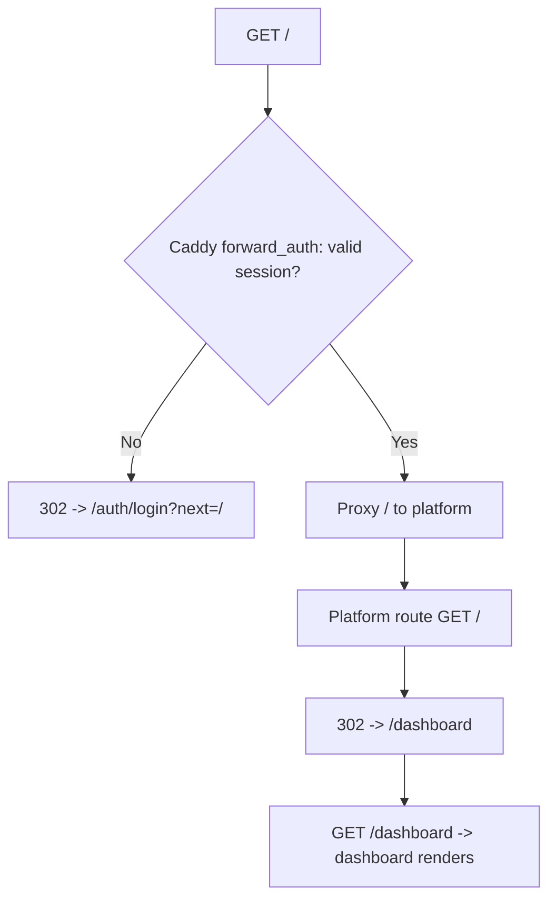
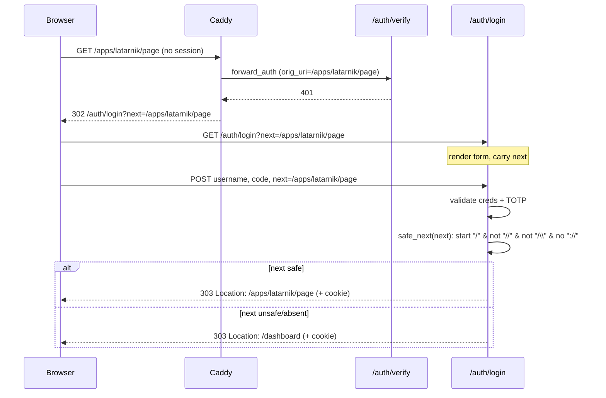
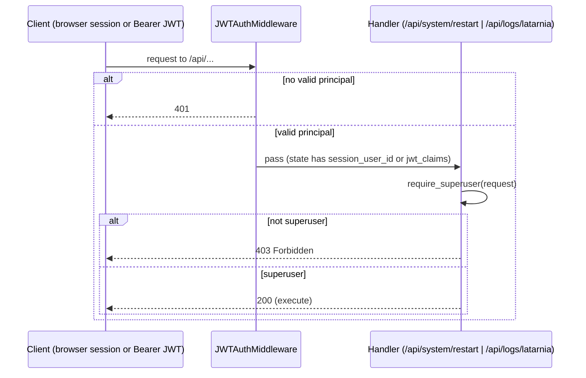
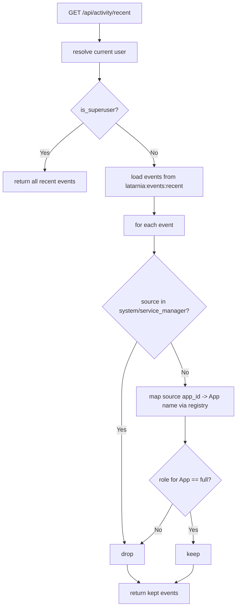
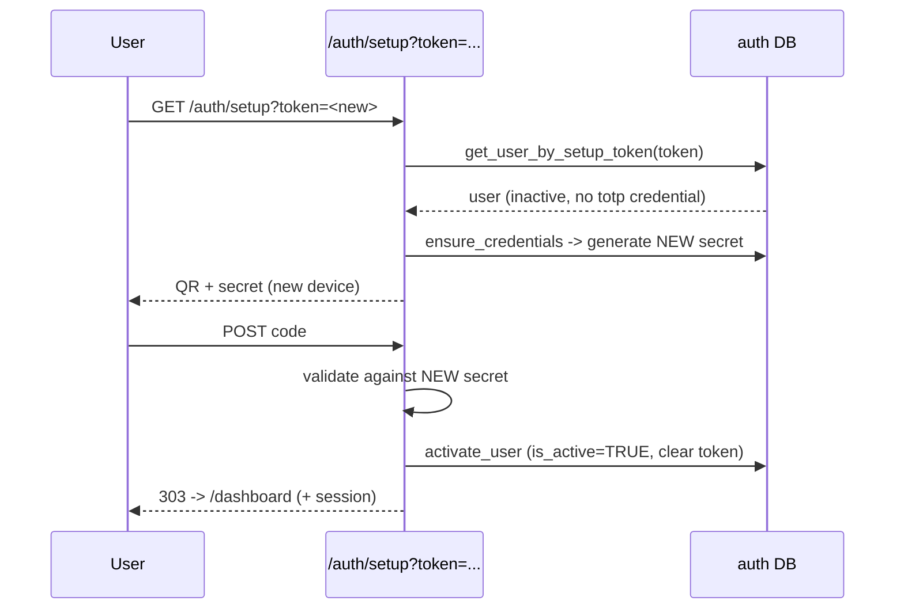

# P-0010 Workflows

Diagrams for the main flows, each tagged with the capability it realizes.

## flow-01 — Authenticated root redirect (cap-001)

## flow-02 — Deep-link login round-trip with hardened next (cap-002)

## flow-03 — Superuser gate on platform actions (cap-003, cap-004)

## flow-04 — Activity feed filtering (cap-005)

## flow-05 — User management: delete / reactivate / re-issue (cap-006, cap-007, cap-008)

```mermaid
flowchart TD
    subgraph Delete [cap-006 DELETE /api/auth/users/id]
        D0[request] --> D1{requester superuser?}
        D1 -- No --> D403[403]
        D1 -- Yes --> D2{target == self?}
        D2 -- Yes --> D409a[409 cannot delete self]
        D2 -- No --> D3{target is last active superuser?}
        D3 -- Yes --> D409b[409 cannot delete last superuser]
        D3 -- No --> D4[DELETE users row]
        D4 --> D5[children CASCADE; granted_by SET NULL]
        D5 --> D200[200]
    end

    subgraph Reactivate [cap-007 POST /api/auth/users/id/activate]
        R0[request] --> R1{requester superuser?}
        R1 -- No --> R403[403]
        R1 -- Yes --> R2{target has totp credential?}
        R2 -- No --> R409[409 re-issue setup instead]
        R2 -- Yes --> R3[set is_active=TRUE]
        R3 --> R200[200]
    end

    subgraph Reissue [cap-008 POST /api/auth/users/id/setup-token]
        I0[request] --> I1{requester superuser?}
        I1 -- No --> I403[403]
        I1 -- Yes --> I2[delete totp user_credentials row]
        I2 --> I3[delete sessions]
        I3 --> I4[is_active=FALSE; new setup_token + expiry]
        I4 --> I200[200 returns setup_url]
    end
```

## flow-06 — Re-enrollment after re-issue (cap-008 continued)

