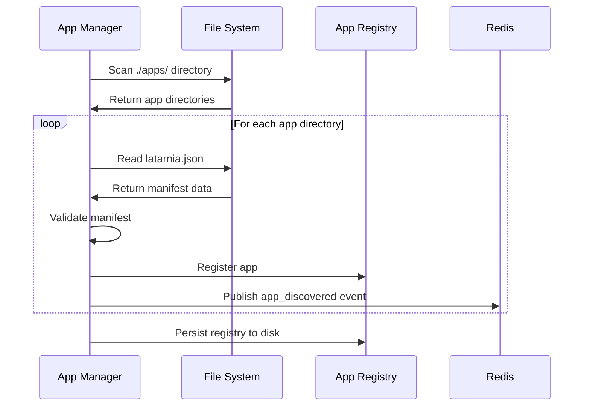
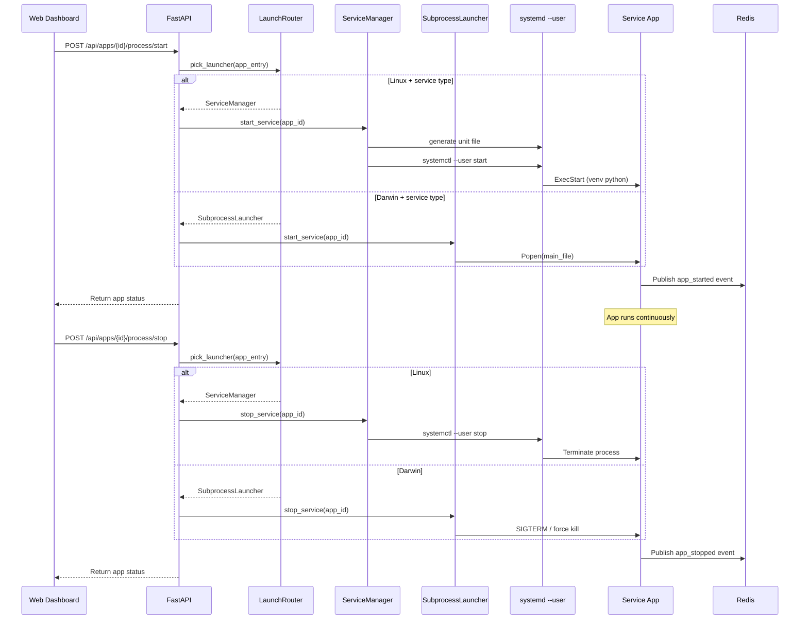
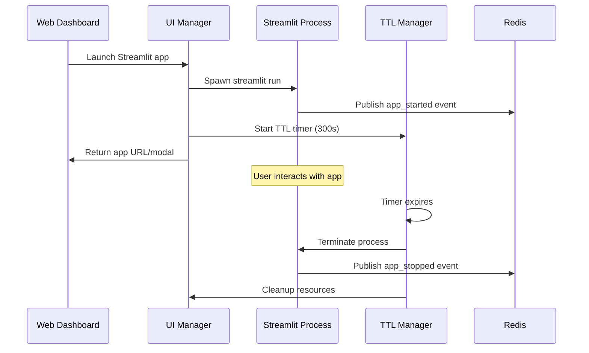
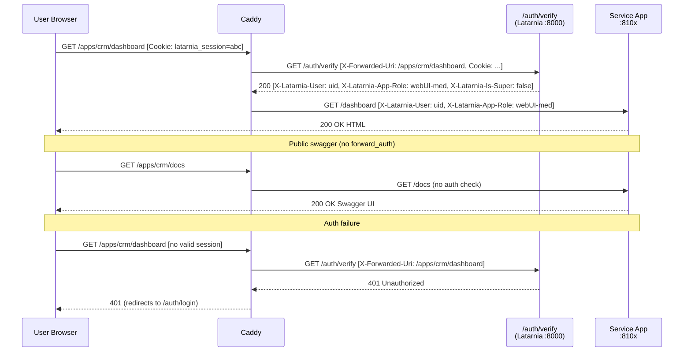

# Latarnia Architecture

This document describes the overall architecture of the Latarnia unified home automation platform.

## System Overview

```mermaid
graph TB
    subgraph "External"
        Browser[Web Browser]
        MCPClient[MCP Client<br/>Claude Desktop etc.]
        User[User]
    end

    subgraph "Caddy (systemd system)"
        CaddyHTTPS[Caddy HTTPS<br/>:443 PRD / :8443 TST]
        CaddyTLS[TLS — Let's Encrypt<br/>self-signed for localhost]
    end

    subgraph "Raspberry Pi 5"
        subgraph "Latarnia Main Application (localhost:8000)"
            FastAPI[FastAPI Web Server<br/>Port 8000]
            AppMgr[App Manager<br/>Discovery & Registry]
            Router[LaunchRouter<br/>os + type → launcher]
            SvcMgr[Service Manager<br/>systemd --user]
            SubLaunch[SubprocessLauncher<br/>macOS fallback]
            UIMgr[UI Manager<br/>Streamlit TTL]
            SysMon[System Monitor<br/>Hardware Metrics]
            MCPGateway[MCP Gateway<br/>/mcp SSE endpoint]
            CaddyMgr[CaddyConfigManager<br/>generates Caddyfile + reload]
            AuthVerify[/auth/verify<br/>session validation + role lookup]
            AuthRoutes[/auth/* and /api/auth/*<br/>login, setup, users, roles, tokens]
            AuthDB[AuthDB<br/>platform DB init + migrations]
            AuthProvider[TOTPAuthProvider<br/>AES-GCM encrypted TOTP]
            SessionStore[SessionStore<br/>session create/validate/expire]
            UserStore[UserStore<br/>user CRUD + setup tokens]
            RoleStore[RoleStore<br/>per-app role lookup + assignment]
            JWTAuth[JWTAuth + MachineTokenStore<br/>HS256 sign/validate/revoke]
            JWTMiddleware[JWTAuthMiddleware<br/>gates /api/* — Bearer or session]
        end

        subgraph "Message Bus"
            Redis[(Redis<br/>Port 6379)]
        end

        subgraph "systemd --user (Linux, linger on)"
            UA[latarnia-{env}-app_a.service]
            UB[latarnia-{env}-app_b.service]
        end

        subgraph "Applications"
            SvcApp1[Service App 1<br/>Port 8100-8199]
            SvcApp2[Service App 2<br/>Port 8100-8199]
            StreamlitApp1[Streamlit App 1<br/>Port 8501+]
            StreamlitApp2[Streamlit App 2<br/>Port 8501+]
        end

        subgraph "System Services"
            FileSystem[Shared Storage<br/>/opt/latarnia/]
            CaddyFile[Caddyfile include<br/>/opt/latarnia/{env}/caddy/]
        end

        subgraph "Platform Auth DB"
            PlatformDB[(latarnia_platform_{env}<br/>Postgres)]
        end
    end

    User --> Browser
    Browser -->|HTTPS| CaddyHTTPS
    MCPClient -->|HTTPS + Bearer JWT| CaddyHTTPS

    CaddyHTTPS -->|forward_auth| AuthVerify
    CaddyHTTPS -->|/auth/* no auth| AuthRoutes
    CaddyHTTPS -->|after auth| FastAPI
    AuthVerify --> SessionStore
    AuthVerify --> UserStore
    AuthVerify --> RoleStore
    AuthRoutes --> AuthDB
    AuthRoutes --> AuthProvider
    AuthRoutes --> SessionStore
    AuthRoutes --> UserStore
    AuthRoutes --> RoleStore
    AuthRoutes --> JWTAuth
    AuthDB --> PlatformDB
    SessionStore --> PlatformDB
    UserStore --> PlatformDB
    RoleStore --> PlatformDB
    JWTAuth --> PlatformDB
    JWTMiddleware --> JWTAuth
    JWTMiddleware --> SessionStore
    CaddyHTTPS -->|after auth, handle_path strips prefix| SvcApp1
    CaddyHTTPS -->|after auth, handle_path strips prefix| SvcApp2
    CaddyHTTPS -->|/apps/{name}/docs no auth| SvcApp1

    FastAPI --> AppMgr
    FastAPI --> Router
    FastAPI --> UIMgr
    FastAPI --> SysMon
    AuthVerify --> AppMgr

    Router -->|Linux + service| SvcMgr
    Router -->|Darwin + service| SubLaunch
    Router -->|any + streamlit| UIMgr

    CaddyMgr --> CaddyFile
    CaddyMgr -->|POST /load Caddy admin API| CaddyHTTPS

    AppMgr --> Redis
    SvcMgr -.systemctl --user.-> UA
    SvcMgr -.systemctl --user.-> UB
    UA -->|ExecStart venv python| SvcApp1
    UB -->|ExecStart venv python| SvcApp2
    SubLaunch -.Popen.-> SvcApp1
    UIMgr --> StreamlitApp1
    UIMgr --> StreamlitApp2

    MCPGateway -->|MCP SSE| SvcApp1
    MCPGateway -->|MCP SSE| SvcApp2

    SvcApp1 --> Redis
    SvcApp2 --> Redis
    StreamlitApp1 --> Redis
    StreamlitApp2 --> Redis

    SvcApp1 --> FileSystem
    SvcApp2 --> FileSystem
    StreamlitApp1 --> FileSystem
    StreamlitApp2 --> FileSystem
```

## Core Components

### 1. FastAPI Main Application
- **Purpose**: Central web server and API gateway
- **Port**: 8000 (configurable)
- **Responsibilities**:
  - Web dashboard serving
  - Health monitoring endpoints
  - System metrics API
  - App management API
  - Configuration management

### 2. App Manager
- **Purpose**: Application discovery and lifecycle management
- **Responsibilities**:
  - Auto-discovery of apps in `./apps/` directory
  - Manifest parsing (`latarnia.json`)
  - In-memory app registry with persistence
  - Dynamic port allocation (8100-8199 range)
  - Python dependency installation
  - App validation and setup

### 3. Launch Router
- **Purpose**: Stateless dispatch function (`pick_launcher`) that selects the correct launcher for each app based on `(platform.system(), manifest.type)`
- **Module**: `latarnia.managers.launcher_router`
- **Routing rules**:
  - `streamlit` type → `StreamlitManager`
  - `service` + Linux → `ServiceManager` (systemctl --user)
  - `service` + Darwin → `SubprocessLauncher` (Popen fork)
- **Used by**: lifespan auto-start loop and `/api/apps/{id}/process/{start,stop,restart}` endpoints

### 4. Service Manager
- **Purpose**: systemd --user lifecycle controller for service apps on Linux
- **Responsibilities**:
  - Per-app unit file generation (`~/.config/systemd/user/latarnia-{env}-{app}.service`)
  - `ExecStart` uses absolute venv Python (`sys.executable`); `Environment=ENV={env}` injected
  - Default `Restart=on-failure` / `RestartSec=5`; overridable via `manifest.config.restart_policy`
  - Units have **independent lifetimes** from the platform (no `PartOf=`): apps survive a platform restart, which is the desired robustness story
  - `linger_enabled()` helper — shells out to `loginctl` on Linux; startup emits `WARNING` if linger is off
  - `reconcile_running_units()` — called during `lifespan()` after discovery on Linux; finds units already `active`/`activating`, parses their `--port` and `--mcp-port` from `ExecStart`, claims those ports in `PortManager`, and marks the app `RUNNING` in the registry so the auto-start loop skips it
  - Service start/stop/restart operations via `systemctl --user`
  - Log access via `journalctl _SYSTEMD_USER_UNIT=latarnia-{env}-{app}.service` (system journal; no `--user` flag, as the Pi has no persistent user-mode journald)

### 5. Subprocess Launcher
- **Purpose**: macOS-only fallback launcher; spawns service apps as direct `Popen` children of the platform
- **Module**: `latarnia.managers.subprocess_launcher` (`SubprocessLauncher`)
- **Responsibilities**:
  - `start_service / stop_service / restart_service` (verbs harmonized with `ServiceManager`)
  - Process tracking by PID; graceful SIGTERM with force-kill fallback
  - No crash recovery (macOS dev path only — systemd restart policy not available)

### 6. UI Manager
- **Purpose**: On-demand Streamlit application management
- **Responsibilities**:
  - Streamlit process spawning
  - TTL-based cleanup (default 300 seconds)
  - Port management for Streamlit apps
  - Modal integration with main dashboard
  - Resource monitoring and cleanup

### 7. System Monitor
- **Purpose**: Hardware and system metrics collection
- **Responsibilities**:
  - CPU usage monitoring
  - Memory utilization tracking
  - Disk space monitoring
  - Temperature sensors (Raspberry Pi specific)
  - Process metrics collection
  - Health status determination

### 8. MCP Gateway
- **Purpose**: Aggregates MCP tools from all MCP-enabled apps and exposes them to external clients through a single endpoint
- **Mount path**: `/mcp` (configurable via `MCPConfig.gateway_path`)
- **Transport**: SSE (`mcp.server.sse.SseServerTransport`) — gateway acts as MCP server to clients and MCP client to apps
- **Responsibilities**:
  - Build and maintain a namespaced tool index (`app_name.tool_name`)
  - Proxy `list_tools` responses from the in-memory index
  - Proxy `call_tool` requests to the appropriate app's MCP server (localhost on declared `mcp_port`)
  - Skip unhealthy apps on tool calls (return error immediately)
  - Sync tool index on app start, stop, and version bump
  - Enforce backward compatibility on version bumps (set-difference check; reject and stop app on violation)
  - Expose `GET /api/mcp/status` and `GET /api/mcp/tools` REST endpoints

### 9. DB Provisioner
- **Purpose**: Provision per-app Postgres databases for apps with `database: true` in their manifest. Apps never touch superuser; the platform handles role + DB creation, privilege grants, and migration execution.
- **Module**: `src/latarnia/managers/db_provisioner.py` (uses `core/pg_client.py` as the superuser-credential client).
- **Responsibilities**:
  - Generate per-app names: `{database_prefix}{app_name}` and `{role_prefix}{app_name}_role`.
  - Create role + database if absent; revoke `PUBLIC` connect; grant connect to the per-app role.
  - **Ensure platform-default extensions** via `CREATE EXTENSION IF NOT EXISTS <ext>` for every entry in `DEFAULT_EXTENSIONS` (currently `["vector"]` for pgvector). Idempotent — runs on both new and reused DBs so existing app DBs get backfilled at the next provisioning pass. Missing OS-level binaries log a `WARNING`, not a failure.
  - Create the `schema_versions` tracking table.
  - Run pending migrations from the app's `migrations/*.sql` directory in numeric order, in a single transaction; record file name + sha256 checksum + duration.
  - Drop database + role on initial provisioning failure (clean slate) — but preserve them on version-bump migration failure.
  - Grant `ALL PRIVILEGES ON ALL TABLES / SEQUENCES IN SCHEMA public` to the per-app role after migrations so the app can use objects created by the superuser.
  - Build the connection URL passed to apps via `--db-url env:DATABASE_URL` + `Environment=DATABASE_URL=...` in the systemd unit.
- **Extensions list (`DEFAULT_EXTENSIONS`)**: append-only, hardcoded today. `vector` was added for embeddings / RAG / semantic search. Adding more (postgis, citext, etc.) is a one-line edit; if per-app extension overrides ever become needed, refactor to manifest-driven at that point.

### 10. Secret Manager
- **Purpose**: Inject runtime secrets (API keys, tokens) into per-app process environments without leaking values to logs, unit files, or other apps. Owns the per-env master secret store and per-app filtered files (P-0006).
- **Module**: `src/latarnia/managers/secret_manager.py`. Wired into both `ServiceManager` (Linux) and `SubprocessLauncher` (Darwin) so refuse-to-start + injection work uniformly across launchers.
- **Master file**: `/opt/latarnia/{env}/secrets.env`, mode 600, operator-edited via `$EDITOR`. Dotenv format (`KEY=value` per line, `#` comments, blank lines, single-quoted values for `$`/`=`/spaces). The platform refuses to read a wider-mode file and logs a warning.
- **Per-app files**: `/opt/latarnia/{env}/secrets/{app_id}.env`, mode 600, written by `materialize()` before each `start_service`. Contains exactly the keys declared in `manifest.config.requires_secrets`. Overwritten on every launch (idempotent).
- **Linux injection**: generated systemd unit references the per-app file via `EnvironmentFile=-/opt/latarnia/{env}/secrets/{app_id}.env` (leading `-` = ignore-if-missing).
- **Darwin injection**: filtered key/value map merged into `subprocess.Popen(env=...)`; no file written.
- **Refuse-to-start gate**: runs before port allocation in both launchers. On missing key, sets `app.runtime_info.error_message = "missing required secret: <name>"`, marks app `ERROR`, returns `False`. Surfaces as `overall_status: red` via the existing P-0005 cap-005 plumbing — no new fields.
- **REST**: `GET /api/secrets` returns `[{name, set_at, used_by: [app_id, ...]}]`. **Never** returns values. Listing is read-only; rotation is `$EDITOR` + restart consuming apps.
- **Logging contract**: no method on this manager ever logs a secret value. Verified by a sentinel-value unit test.
- **Out of v1**: encryption at rest, audit log, rotation automation, CLI binary, dashboard panel, multi-line values, cross-env sharing.

### 11. Redis Message Bus
- **Purpose**: Inter-app communication and event system
- **Responsibilities**:
  - Pub/Sub messaging between apps
  - Event logging and history
  - Health monitoring data
  - Configuration change notifications
  - App status updates

### 12. Caddy Ingress
- **Purpose**: Caddy (systemd system service) is the single external HTTPS ingress and reverse proxy. The platform's own Python web proxy (`web_proxy.py`) was removed in P-0008.
- **TLS**: Let's Encrypt ACME (real domains); Caddy self-signed (localhost dev). Domain read from `{ENV}_DOMAIN` config.
- **Ports**: `:443` PRD, `:8443` TST, `:80` ACME HTTP-01 challenge.
- **Route structure** (generated per environment by `CaddyConfigManager`):
  - `/auth/*`, `/docs*`, `/openapi.json` — public, proxied to Latarnia `:8000`
  - `/apps/{name}/docs*`, `/apps/{name}/openapi.json` — public, proxied directly to app port (Service Apps only)
  - `/apps/{name}/*` — protected via `forward_auth` to `/auth/verify`; Caddy strips the `/apps/{name}` prefix with `handle_path` before proxying to app port (Service Apps only; Streamlit Apps have no Caddy route block)
  - `/*` catch-all — protected via `forward_auth`; proxied to Latarnia `:8000` (covers dashboard, `/api/*`, `/mcp/*`)
- **Auth headers copied**: `X-Latarnia-User`, `X-Latarnia-App-Role`, `X-Latarnia-Is-Super`
- **CaddyConfigManager** (`src/latarnia/caddy/manager.py`): reads the App Registry, generates the per-environment Caddyfile include at `/opt/latarnia/{env}/caddy/latarnia.caddyfile`, then reloads Caddy via `POST /load` on the Caddy admin API (`:2019`). Called on every App registration change.
- **Firewall**: `ufw` blocks Latarnia `:8000` and app ports `:81xx` / `:90xx` from external access — all external traffic enters through Caddy only.

### 13. Auth Components (P-0008 Scopes 2–4)

These components implement persistent authentication, authorization, and machine-token issuance. They all operate against `latarnia_platform_{env}` and are distinct from the per-app DB Provisioner path.

- **AuthDB** (`src/latarnia/auth/db.py`): Creates `latarnia_platform_{env}` at startup and applies pending platform migrations from `src/latarnia/auth/migrations/` using the same sequential runner and `schema_versions` checksum pattern as the DB Provisioner.
- **AuthProvider / TOTPAuthProvider** (`src/latarnia/auth/providers/`): `AuthProvider` is a Protocol defining `setup_credentials`, `validate`, and `get_setup_form_spec`. `TOTPAuthProvider` is the V1 implementation — generates TOTP secrets, encrypts them with AES-256-GCM (key from `LATARNIA_TOTP_ENC_KEY` in `secrets.env`), and validates TOTP codes.
- **UserStore** (`src/latarnia/auth/users.py`): User CRUD — create user with setup token, list, deactivate. The first user created via `/auth/setup` becomes the superuser.
- **SessionStore** (`src/latarnia/auth/sessions.py`): Session create/validate/expire. Cookie value is a random UUIDv4; only its SHA-256 hash is stored. Expired sessions are lazily garbage-collected at login time.
- **RoleStore** (`src/latarnia/auth/roles.py`): Per-app role lookup and assignment over the `app_roles` table. Role enum: `none | webUI-low | webUI-med | webUI-full | full`. Superuser is a user attribute (not a per-app role) and always resolves to `full`. `is_visible(role)` returns false for `none`, controlling dashboard tile visibility. Role management API: `GET /api/auth/roles`, `GET /api/auth/roles/all` (superuser), `POST /api/auth/roles/{app}` (superuser).
- **JWTAuth / MachineTokenStore** (`src/latarnia/auth/jwt_auth.py`, `tokens.py`): Signs and validates HS256 JWTs (key: `LATARNIA_JWT_SECRET` from `secrets.env`). JWT claims: `{sub, iat, exp, apps, super}`. `MachineTokenStore` persists tokens to the `machine_tokens` table (SHA-256 of raw JWT stored, never plaintext) and supports create/list/revoke. Token management API: `POST /api/auth/tokens`, `GET /api/auth/tokens`, `DELETE /api/auth/tokens/{id}`.
- **JWTAuthMiddleware** (`src/latarnia/auth/middleware.py`): Pure-ASGI middleware that gates all `/api/*` requests. Accepts either a `Bearer <jwt>` (validated + revocation-checked against `machine_tokens`) or a session cookie. Passes `/mcp` and websocket connections through without session-cookie gating — the MCP Gateway validates its own JWT. Returns 401 on any other unauthenticated request to `/api/*`.
- **Auth Routes** (`src/latarnia/auth/routes.py`): FastAPI router mounting `/auth/*` (login, setup, logout — browser flows) and `/api/auth/*` (user management, role management, machine token management — JSON API). The `/auth/verify` endpoint is the Caddy `forward_auth` target; it validates the session hash, looks up the per-app role via `RoleStore`, and returns `X-Latarnia-User`, `X-Latarnia-App-Role`, and `X-Latarnia-Is-Super` headers.

## Application Types

### Service Apps
```mermaid
graph LR
    subgraph "Service App"
        Main[main.py<br/>FastAPI/Flask]
        Health[&sol;health endpoint]
        UI[&sol;ui endpoint<br/>REST API]
        Logic[Business Logic]
        Data[Data Processing]
    end
    
    subgraph "Latarnia Integration"
        Manifest[latarnia.json]
        Requirements[requirements.txt]
        Setup[setup.py/commands]
    end
    
    subgraph "System Integration"
        systemd[systemd user unit<br/>latarnia-{env}-{app_id}.service]
        Redis[Redis Pub/Sub]
        Storage[/opt/latarnia/{env}/data/{app_id}/]
        Journal[journald<br/>system journal]
    end
    
    Main --> Health
    Main --> UI
    Main --> Logic
    Logic --> Data
    
    Manifest --> systemd
    Requirements --> systemd
    Setup --> systemd
    
    Main --> Redis
    Main --> Storage
    Main -->|stdout/stderr| Journal
```

### Streamlit Apps
```mermaid
graph LR
    subgraph "Streamlit App"
        App[app.py<br/>Streamlit UI]
        Components[UI Components]
        Widgets[Interactive Widgets]
        Charts[Data Visualization]
    end
    
    subgraph "Latarnia Integration"
        Manifest[latarnia.json]
        Requirements[requirements.txt]
    end
    
    subgraph "Runtime Management"
        TTL[TTL Manager<br/>300s default]
        Process[Process Spawning]
        Cleanup[Resource Cleanup]
    end
    
    subgraph "System Integration"
        Redis[Redis Pub/Sub]
        Storage[/opt/latarnia/{env}/data/{app_id}/]
        Logs[/opt/latarnia/{env}/logs/{app_id}-streamlit.log]
    end
    
    App --> Components
    App --> Widgets
    App --> Charts
    
    Manifest --> Process
    Requirements --> Process
    
    Process --> TTL
    TTL --> Cleanup
    
    App --> Redis
    App --> Storage
    App --> Logs
```

## Log Access Dispatch

The `/api/apps/{id}/logs` endpoint selects the log source based on `(OS, app type)`:

| OS | Type | Source |
|----|------|--------|
| Linux | service | `journalctl _SYSTEMD_USER_UNIT=latarnia-{env}-{app}.service` (system journal, no `--user`) |
| Darwin | service | SubprocessLauncher stdout-redirect file (`logs_dir/{app_id}.log`) |
| Any | streamlit | StreamlitManager stdout-redirect file (`logs_dir/{app_id}-streamlit.log`) |

Apps log to stdout/stderr only; they no longer receive a `--logs-dir` flag. The `config.logs_dir` manifest field is deprecated (kept for backward compatibility, ignored at runtime).

## Data Flow

### App Discovery Flow


### Service App Lifecycle


### Streamlit App Lifecycle


### Caddy Authenticated App Request Flow


## Security Model

### Process Isolation
- Each app runs as separate systemd service
- Apps cannot access each other's data directly
- Shared resources through well-defined interfaces only

### File System Security
- Apps have dedicated data directories
- No cross-app file access
- Logs isolated per application
- Configuration files protected

### Network Security
- Port allocation managed centrally
- Apps communicate via Redis message bus
- No direct inter-app network connections
- Caddy is the sole external ingress; app ports and Latarnia :8000 are blocked from external access by ufw
- All external traffic to app web UIs passes through Caddy's `forward_auth` gate
- All `/api/*` requests are gated by `JWTAuthMiddleware`: accepts Bearer JWT (validated + revocation-checked) or a valid session cookie; 401 otherwise
- Machine clients (scripts, AI agents) authenticate with long-lived HS256 JWTs issued via `POST /api/auth/tokens` (superuser session required). JWT revocation is a DB lookup on every request
- MCP Gateway requires a Bearer JWT to open the SSE session; per-connection `ContextVar` carries the token's app scope to isolate concurrent agent connections

### Resource Management
- Memory and CPU limits via systemd
- TTL-based cleanup for temporary processes
- Disk usage monitoring and alerts
- Process count limitations

## Deployment Architecture

### Development Environment
```
localhost (Caddy self-signed TLS, port from {ENV}_DOMAIN config)
└── forward_auth → localhost:8000 (/auth/verify — added Scope 2)
localhost:8000 (Main Dashboard + API + MCP Gateway at /mcp)
├── localhost:8100-8199 (Service App REST servers — internal only)
├── localhost:9001-9099 (Service App MCP servers, declared in manifest)
├── localhost:8501+     (Streamlit Apps)
└── localhost:6379      (Redis)
```

### Production Environment (Raspberry Pi)
```
Caddy :443 PRD / :8443 TST (Let's Encrypt TLS, ufw allows 80/443/8443/22)
└── forward_auth → localhost:8000 (/auth/verify — added Scope 2)
localhost:8000 (Main Dashboard + API + MCP Gateway at /mcp — internal only)
├── Internal:8100-8199 (Service App REST servers — internal only)
├── Internal:9001-9099 (Service App MCP servers, declared in manifest)
├── Internal:8501+     (Streamlit Apps)
└── Internal:6379      (Redis)

systemd system unit:
/etc/systemd/system/
└── caddy.service  (ports 80 ACME, 443 PRD, 8443 TST, 2019 admin)

systemd --user units (per-app, generated at runtime):
~/.config/systemd/user/
├── latarnia-tst-{app}.service   (TST env apps)
└── latarnia-prd-{app}.service   (PRD env apps)
Each unit: ExecStart=<venv>/bin/python, Restart=on-failure, RestartSec=5
           Environment=ENV={env}
           (No PartOf= — units have independent lifetimes from the platform)
Logs: journalctl _SYSTEMD_USER_UNIT=latarnia-{env}-{app}.service (system journal)
Prerequisite: sudo loginctl enable-linger {user}
```

### File System Layout
```
/opt/latarnia/
├── config/config.json
├── src/latarnia/ (Application code)
├── apps/ (Discovered applications)
├── data/ (Per-app data directories)
├── logs/ (Per-app log directories)
├── registry/ (App registry persistence)
├── prd/caddy/latarnia.caddyfile  (generated by CaddyConfigManager — PRD)
└── tst/caddy/latarnia.caddyfile  (generated by CaddyConfigManager — TST)

/etc/caddy/Caddyfile  (manually configured; imports the per-env includes above)
```

## Performance Considerations

### Resource Optimization
- Manual refresh pattern (no auto-updates)
- TTL-based Streamlit cleanup
- Efficient Redis pub/sub usage
- systemd resource limits

### Scalability Targets
- Support 10-20 concurrent apps
- Raspberry Pi 5 with 8GB RAM
- Minimal CPU overhead for main app
- Efficient memory usage patterns

### Monitoring Strategy
- Hardware metrics collection
- Process resource monitoring
- Redis performance tracking
- App health check polling
