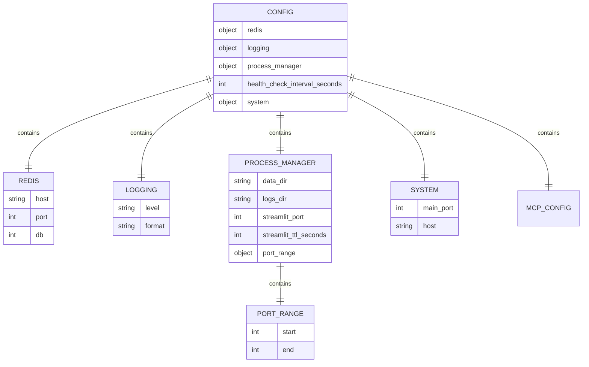
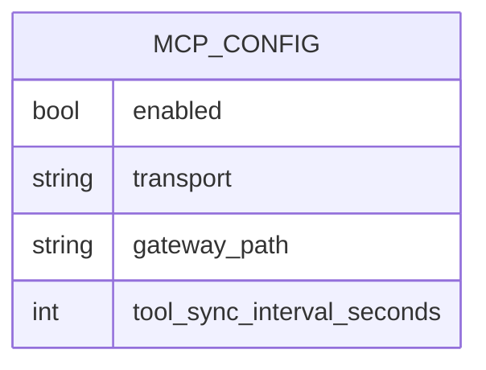
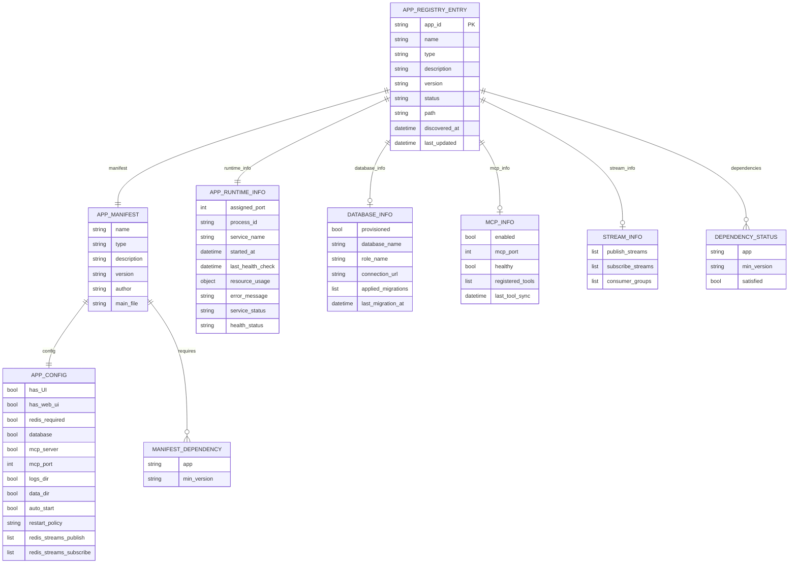
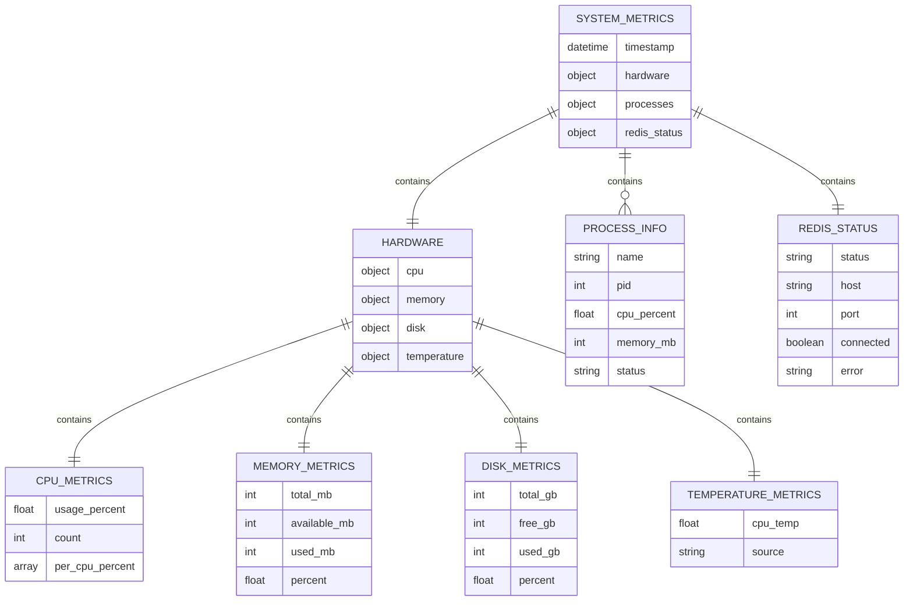
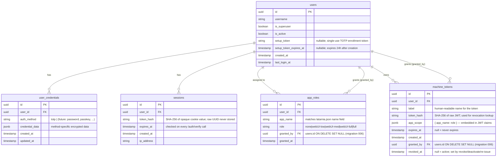
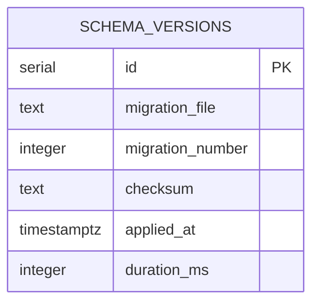
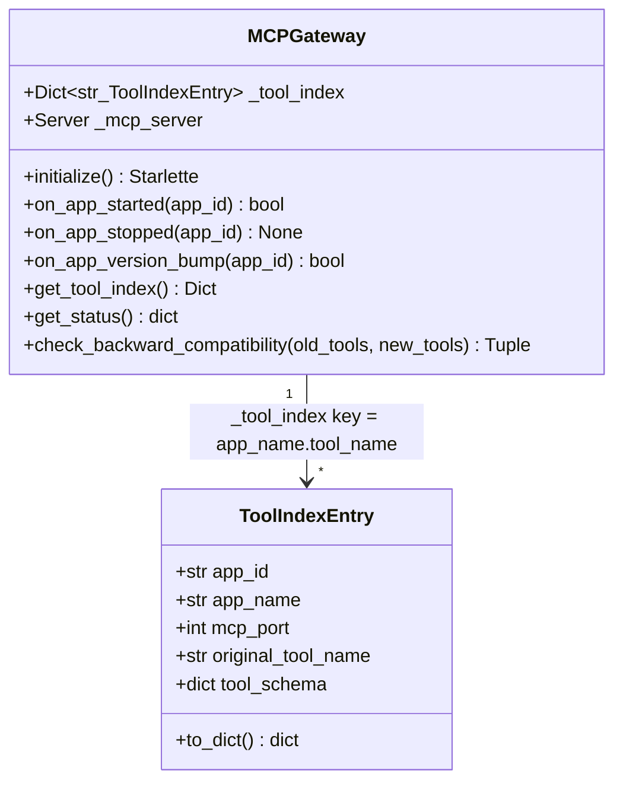

# Latarnia Database Schema

This document describes the data storage and persistence strategy for the Latarnia platform.

## Storage Strategy

Latarnia uses a hybrid storage approach optimized for Raspberry Pi deployment:

- **Configuration**: JSON files for human-readable settings
- **App Registry**: JSON persistence with in-memory operations
- **Message Bus**: Redis for real-time communication
- **Logs**: File-based logging with rotation
- **App Data**: File-based storage per application

## Data Models

### Configuration Schema



### MCP Configuration Schema



`enabled` defaults to `false`. When `true`, the gateway is initialized and mounted at `gateway_path` (default `/mcp`) using SSE transport.

### App Registry Schema

The registry entry (`AppRegistryEntry`) was extended in P-0002 with capability sub-objects for database, MCP, and stream state. All fields are optional — apps that do not declare a capability have `null` for that info block.



### System Metrics Schema



### Platform Auth Database Schema

The platform owns a separate Postgres database — `latarnia_platform_{env}` (e.g., `latarnia_platform_dev`, `latarnia_platform_tst`, `latarnia_platform_prd`) — created and migrated by `AuthDB` (`src/latarnia/auth/db.py`) at Latarnia startup. This DB is **distinct from the per-app databases** provisioned by the DB Provisioner; it uses the platform's admin credentials and is never passed to App processes.

Five tables live in this database. Migrations are in `src/latarnia/auth/migrations/001–005` and applied via the same sequential runner + `schema_versions` pattern used by the DB Provisioner.



**Key field notes:**
- `user_credentials.credential_data`: for TOTP, contains `{"totp_secret_enc": "<base64-nonce+ciphertext>"}`. The TOTP secret is encrypted with AES-256-GCM using `LATARNIA_TOTP_ENC_KEY` from `secrets.env`. Nonce is prepended to ciphertext.
- `sessions.token_hash`: cookie value is a random UUIDv4 never persisted; only its SHA-256 hash is stored.
- `app_roles.role` enum: `none`, `webUI-low`, `webUI-med`, `webUI-full`, `full`. Default effective role when no row exists: `none`. `full` is the only role granting REST API access.
- `machine_tokens`: JWT claims carry `sub` (user_id), `iat`, `exp`, `apps` (copy of `app_scope`), `super` (bool). Revocation check is a DB lookup on every API call. `revoked_at` is set on individual revocation, on user deactivation (`deactivate_user`), and on re-issue (`reissue_setup_token`); reactivation does NOT clear it.
- `app_roles.granted_by` and `machine_tokens.granted_by`: `ON DELETE SET NULL` (migration 006) — rows survive the deletion of the granting Superuser with `granted_by = NULL`.

### Postgres Per-App Database Schema

Each app with `database: true` receives its own Postgres database (`{database_prefix}{app_name}`, e.g. `tst_latarnia_crm`) and role (`{role_prefix}{app_name}_role`). The platform creates the following tracking table in every provisioned database.

**Platform-default extensions:** Every Latarnia-provisioned app DB has `vector` (pgvector) enabled by the platform at provisioning time. Apps using `vector(N)` columns or HNSW indexes do NOT need a `CREATE EXTENSION` migration — the per-app role doesn't have privilege anyway. The list lives in `db_provisioner.py::DEFAULT_EXTENSIONS`.



Migration files are named with a numeric prefix (e.g., `001_initial.sql`, `002_add_tags.sql`). The platform runs only migrations whose `migration_file` is not already recorded in `schema_versions`.

### MCP Gateway In-Memory Model

The MCP gateway maintains an in-memory tool index. This model is not persisted to disk between restarts; it is rebuilt from running apps on startup.



Tool index key format: `"{app_name}.{tool_name}"` — no nesting beyond one level.

## File System Structure

Paths are env-scoped (P-0004): the same Pi runs `tst` and `prd` side-by-side under `/opt/latarnia/{env}/` with no shared mutable state.

### Per-environment layout
```
/opt/latarnia/{env}/                   # env ∈ {tst, prd}
├── .venv/                             # Python venv (one per env, used by main + per-app units)
├── src/                               # Platform source (git checkout)
├── apps/                              # Discovered apps (deploy-time copy of examples/, plus real apps in PRD)
│   └── {app_id}/
│       ├── latarnia.json
│       ├── app.py
│       ├── requirements.txt
│       └── migrations/                # Optional, for apps with database: true
├── data/
│   └── {app_id}/                      # Per-app data dir; passed via --data-dir
├── logs/
│   └── {app_id}.log                   # macOS dev only (SubprocessLauncher Popen redirect)
│   └── {app_id}-streamlit.log         # Streamlit apps (per-streamlit subprocess redirect)
├── secrets.env                        # Master secret store (operator-edited, mode 600). NEW in P-0006.
└── secrets/                           # Per-app filtered files (platform-managed, mode 700). NEW in P-0006.
    └── {app_id}.env                   # Mode 600. Contains only keys this app declared in requires_secrets.
```

### Per-user systemd state (Linux only)
```
~felipe/.config/systemd/user/
├── latarnia-tst-{app_id}.service      # Generated at runtime by ServiceManager
└── latarnia-prd-{app_id}.service
```

### Platform main-unit (system-scope)
```
/etc/systemd/system/
├── latarnia-tst.service               # Installed once at bootstrap (see deployment skill)
└── latarnia-prd.service
```

### Logs

- **Service apps on Linux**: stdout/stderr → systemd journal (queryable with `journalctl _SYSTEMD_USER_UNIT=latarnia-{env}-{app_id}.service`). No per-app log files on disk.
- **Service apps on macOS dev**: stdout/stderr → `logs/{app_id}.log` (SubprocessLauncher Popen redirect).
- **Streamlit apps (any OS)**: stdout/stderr → `logs/{app_id}-streamlit.log` (StreamlitManager Popen redirect).
- **Platform main process**: still writes `latarnia-main.log` under `logs/` (legacy; not env-scoped per app since the main unit is the only writer).

### Registry

There is **no on-disk registry**. `AppRegistry` is rebuilt on every platform start by `discover_apps()` scanning `apps/`, plus reconciliation against any surviving `latarnia-{env}-*.service` user units (P-0005 Scope 4). Port allocations are also in-memory only.

## Redis Data Structures

### Message Bus Channels
```
latarnia:events              # General system events
latarnia:apps:*              # App-specific events
latarnia:health              # Health check events
latarnia:metrics             # System metrics
latarnia:logs                # Log events
```

### Redis Keys
```
latarnia:config              # Cached configuration
latarnia:apps:registry       # App registry cache
latarnia:system:metrics      # Latest system metrics
latarnia:ports:allocated     # Port allocation tracking
latarnia:health:*            # Health check results
```

### Redis Streams

Apps that declare `redis_streams_publish` or `redis_streams_subscribe` in their manifest have streams and consumer groups provisioned by the platform at discovery time.

```
latarnia:streams:{declared_name}   # Stream key (e.g. latarnia:streams:crm.contacts.created)
```

- **Publishers**: one owner per stream (collision causes registration failure). The platform records stream ownership in `StreamManager._publisher_map` (in-memory).
- **Subscribers**: one consumer group per subscribing app, named `{app_id}` within the stream. Tracked in `StreamManager._subscriber_groups`.
- **App usage**: apps `XADD` to their publish streams and `XREADGROUP` / `XACK` from their subscribe consumer groups using a Redis connection they manage themselves.

### Event Message Format
```json
{
  "timestamp": "2024-01-01T12:00:00Z",
  "event_type": "app_started|app_stopped|health_check|error",
  "source": "app_id|system|service_manager",
  "data": {
    "app_id": "camera-detection",
    "status": "running",
    "port": 8101,
    "pid": 12345
  },
  "metadata": {
    "version": "1.0.0",
    "correlation_id": "uuid"
  }
}
```

## Data Persistence Patterns

### Configuration Management
- **Primary**: JSON file (`config/config.json`)
- **Backup**: Automatic backup on changes
- **Environment**: Override via `LATARNIA_*` variables
- **Validation**: Pydantic models with type checking

### App Registry Management
- **Primary**: In-memory dictionary for fast access
- **Persistence**: JSON file with atomic writes
- **Backup**: Daily snapshots in history directory
- **Recovery**: Automatic reload from disk on startup

### System Metrics
- **Collection**: Real-time via psutil
- **Storage**: Redis with TTL (1 hour)
- **Aggregation**: No historical storage (manual refresh pattern)
- **Export**: On-demand JSON API

### Log Management
- **Format**: Structured logging with timestamps
- **Rotation**: Size-based rotation (10MB per file)
- **Retention**: 30 days for app logs, 7 days for system logs
- **Access**: File-based reading with pagination

## Data Migration Strategy

### Version 1.0 Schema
- Initial implementation with JSON persistence
- No database migrations required
- Configuration schema versioning

### Future Considerations
- SQLite integration for complex queries
- Time-series database for metrics history
- Backup and restore procedures
- Data export/import capabilities

## Performance Considerations

### Memory Usage
- In-memory app registry (< 1MB for 100 apps)
- Redis memory limits (64MB default)
- Log file size limits (10MB per file)
- Metrics data TTL (1 hour)

### Disk Usage
- Configuration files (< 1KB)
- App registry (< 100KB for 100 apps)
- Log files (rotated, max 100MB per app)
- App data (unlimited, per-app responsibility)

### Access Patterns
- Configuration: Read on startup, write on changes
- App registry: Read frequently, write on discovery/changes
- Metrics: Read on dashboard access, write every 60 seconds
- Logs: Write continuously, read on demand

## Backup and Recovery

There is no automatic backup loop today. App registry and port allocations are in-memory and rebuilt on platform start (no backup needed). What's worth backing up:

| Source | Notes |
|---|---|
| **Per-env `data/{app_id}/`** | App-managed persistent state (manifest sets `data_dir: true`). Single rsync target per env. |
| **`latarnia_platform_{env}`** | Platform auth DB (users, sessions, app_roles, machine_tokens, user_credentials). Owned by the platform; not app-specific. `pg_dump latarnia_platform_{env}`. |
| **Postgres per-app DBs** | Provisioned by `db_provisioner.py`; one DB per app that declares `database: true`. `pg_dump` per DB; the registry knows the DB names. |
| **Redis** | RDB / AOF as configured on the host. The platform doesn't manage Redis lifecycle. |
| **`/etc/systemd/system/latarnia-{env}.service`** | Bootstrap artefact, installed manually per host. Not env-data. |

A platform-managed centralized backup loop (per-app data + per-app DBs, driven by the manifest) is a candidate for a future scope; nothing automates it today.

### Manual Backup Procedures
```bash
# Per-env app data (rsync target)
rsync -a /opt/latarnia/{env}/data/ /backup/{env}-data-$(date +%Y%m%d)/

# Per-app Postgres dump (iterate the registry — one DB per app with database:true)
pg_dump -h localhost -U superuser {env}_latarnia_{app_id} > /backup/{env}-{app_id}-$(date +%Y%m%d).sql

# Redis (host-level, both envs share the same instance)
redis-cli BGSAVE
cp /var/lib/redis/dump.rdb /backup/redis-$(date +%Y%m%d).rdb
```

### Recovery Procedures
1. `sudo systemctl stop latarnia-{env}.service`
2. Restore the per-env `data/` directory.
3. Restore per-app Postgres DBs (`psql ... < dump.sql`).
4. `sudo systemctl start latarnia-{env}.service` — discovery + reconciliation runs automatically.
5. Verify app discovery and status
