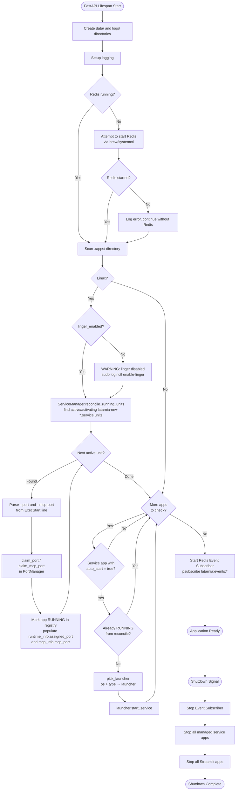
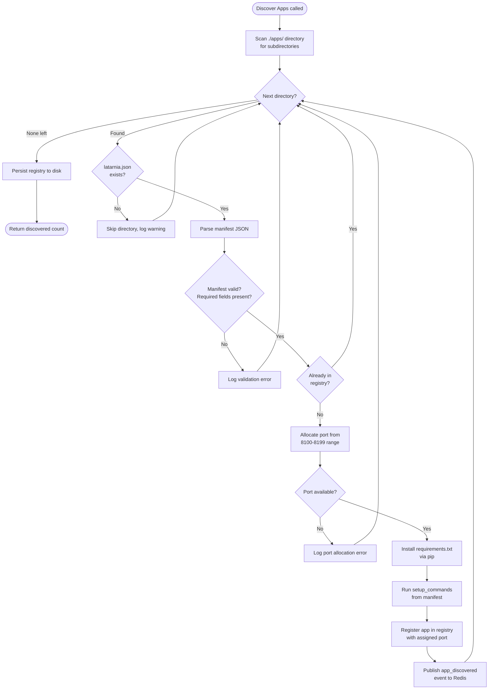
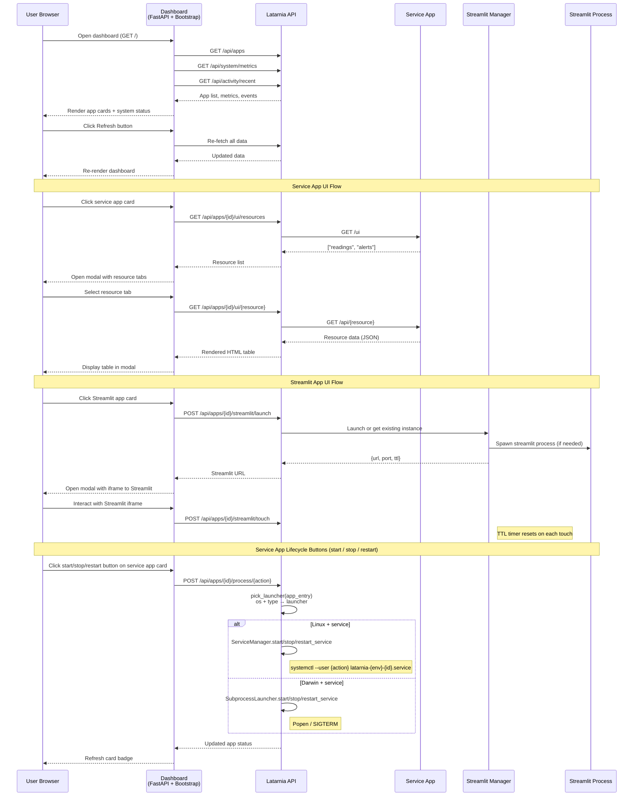
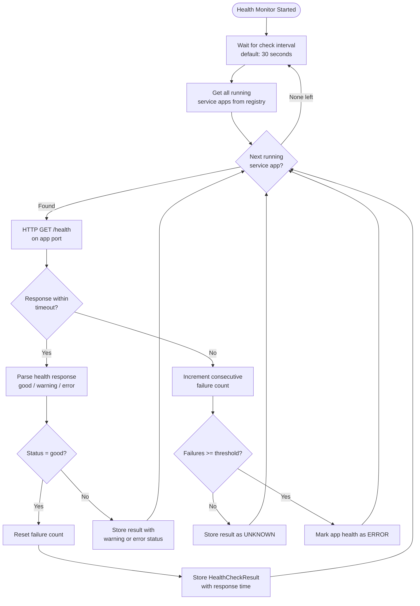
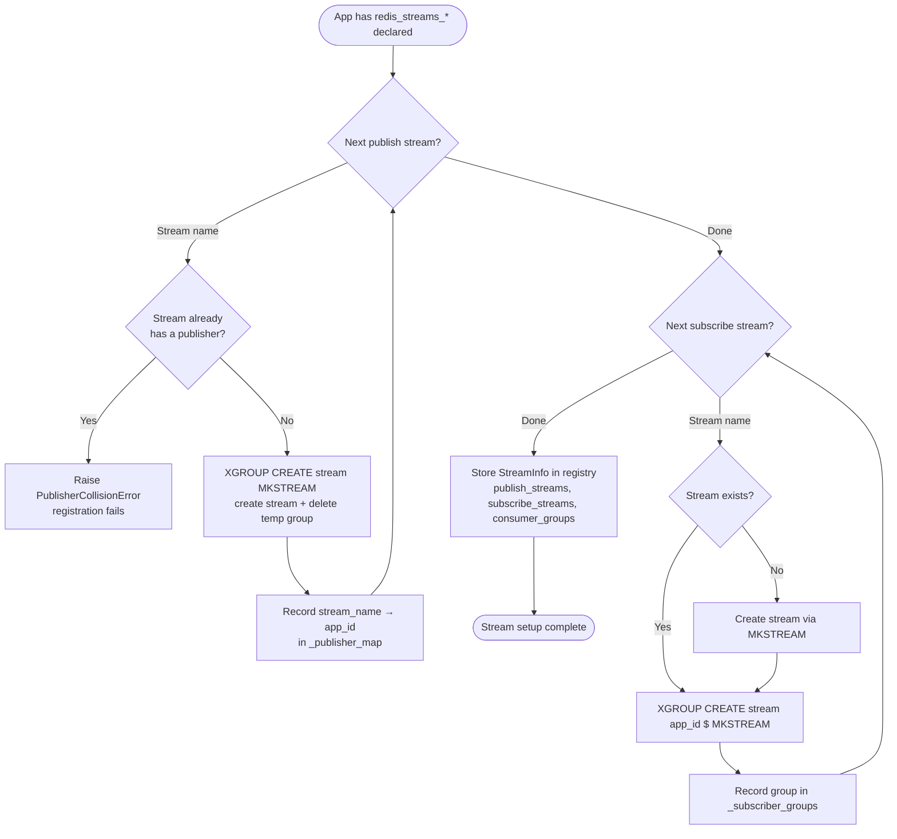
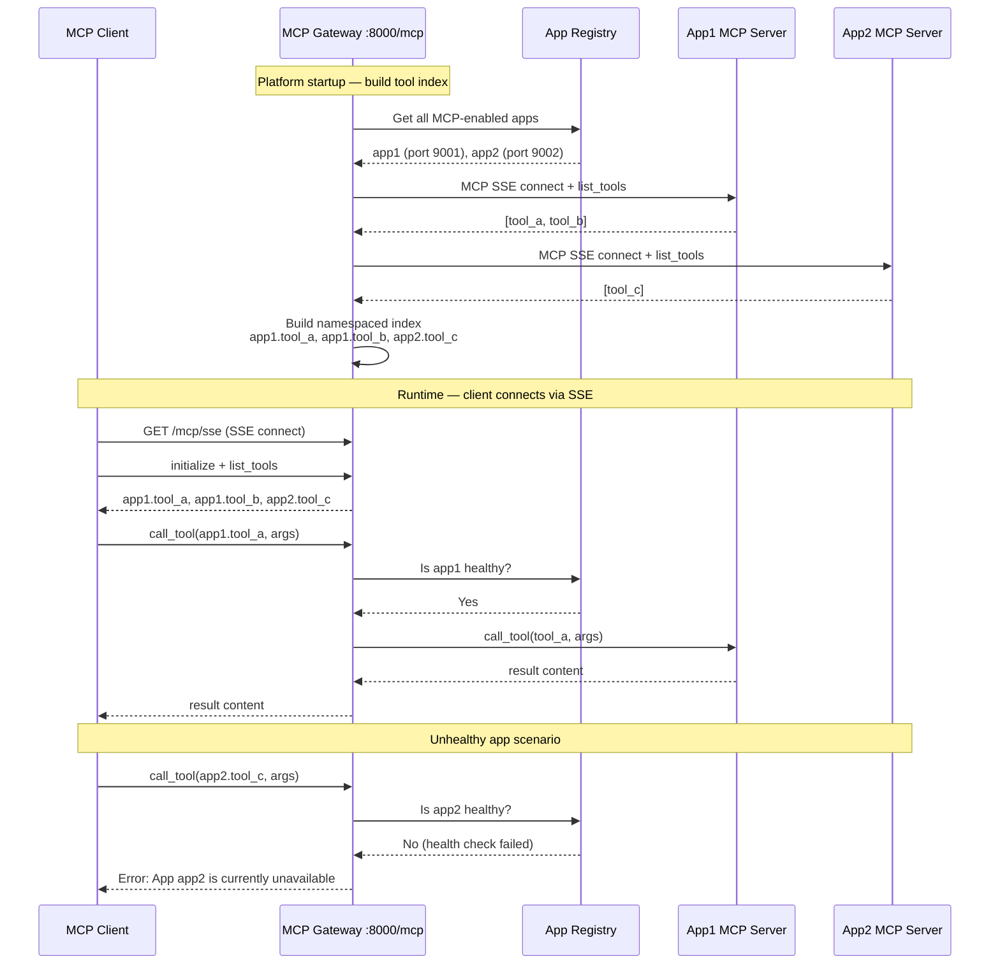
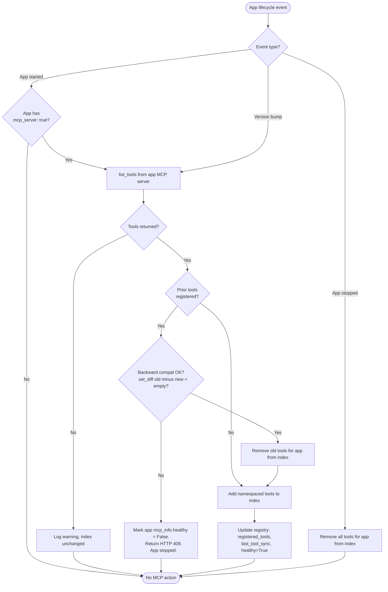
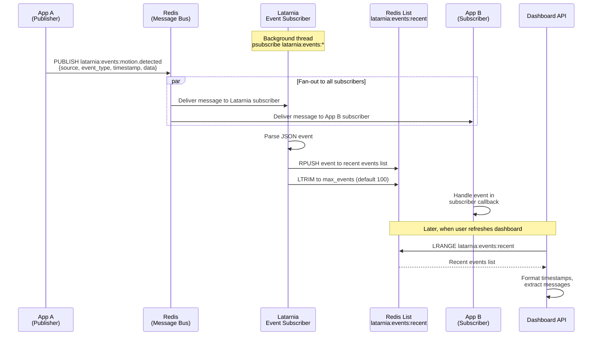
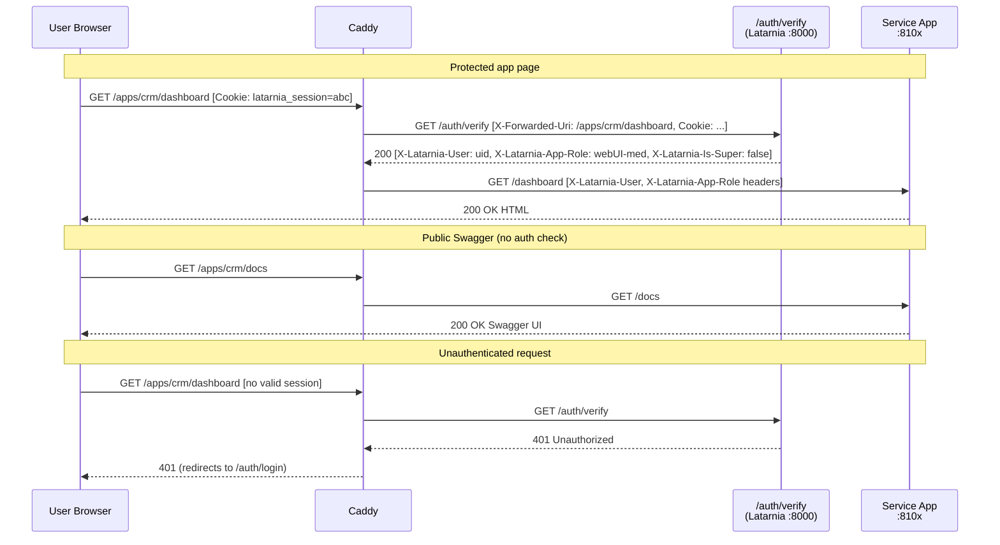
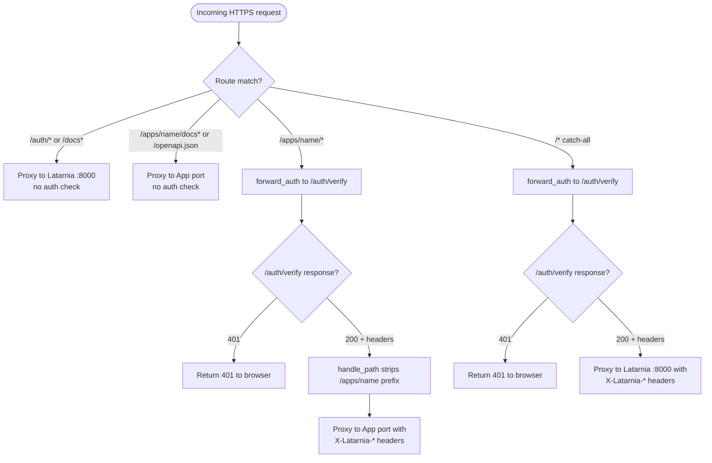

# Latarnia Workflows

This document covers the main process flows and interaction patterns in Latarnia. For component architecture and lifecycle sequence diagrams, see [architecture.md](architecture.md).

## 1. Application Startup

What happens when the Latarnia main application starts (the `lifespan` function in `main.py`).



## 2. App Installation and Discovery

Decision logic when the App Manager scans the `./apps/` directory and processes each app folder.



## 3. Dashboard UI Interaction

How a user navigates the web dashboard and interacts with apps through modals.



## 4. Health Check Monitoring

How the HealthMonitor periodically checks service app health and tracks failures.



## 5. Database Provisioning and Migration

How the DB Provisioner creates a per-app Postgres database and executes pending migrations. Called during app discovery when `database: true`. References cap-003 and cap-004 in P-0002.

```mermaid
flowchart TD
    Start([App has database: true]) --> CheckRole{Role exists?}

    CheckRole -- No --> CreateRole[CREATE ROLE latarnia_{app}_role WITH LOGIN PASSWORD]
    CheckRole -- Yes --> UpdatePwd[ALTER ROLE — rotate password]
    CreateRole --> CheckDB{Database exists?}
    UpdatePwd --> CheckDB

    CheckDB -- No --> CreateDB[CREATE DATABASE latarnia_{app} OWNER role]
    CreateDB --> Revoke[REVOKE CONNECT FROM PUBLIC]
    Revoke --> Grant[GRANT CONNECT TO role]
    Grant --> SchemaTable[CREATE TABLE IF NOT EXISTS schema_versions]
    CheckDB -- Yes --> SchemaTable

    SchemaTable --> ListFiles[List migrations/ directory,<br/>sort by numeric prefix]
    ListFiles --> QueryApplied[Query schema_versions for<br/>already-applied files]
    QueryApplied --> Pending{Pending migrations?}

    Pending -- None --> BuildURL[Build connection_url for app]
    BuildURL --> StoreInfo[Store DatabaseInfo in registry<br/>database_name, role_name, connection_url, applied_migrations]
    StoreInfo --> Done([Return ProvisioningResult success])

    Pending -- Yes --> RunTx[BEGIN transaction on app DB]
    RunTx --> NextMig{Next pending migration?}

    NextMig -- Done --> CommitTx[COMMIT transaction]
    CommitTx --> BuildURL

    NextMig -- Found --> ExecSQL[Execute migration SQL]
    ExecSQL --> SQLOk{SQL succeeded?}
    SQLOk -- Yes --> RecordMig[INSERT into schema_versions<br/>file, number, checksum, duration_ms]
    RecordMig --> NextMig

    SQLOk -- No --> Rollback[ROLLBACK transaction]
    Rollback --> DropDB[DROP DATABASE + DROP ROLE<br/>clean-slate teardown]
    DropDB --> Fail([Return ProvisioningResult failure<br/>app NOT started])
```

## 6. Redis Streams Setup

How the Stream Manager sets up streams and consumer groups during app discovery. Called after DB provisioning (if any). References cap-007 in P-0002.



On app **unregistration**, the Stream Manager calls `cleanup_app_streams(app_id)`:
- Removes all consumer groups owned by the app from their streams.
- Releases the app's publisher ownership entries from `_publisher_map`.
- Does NOT delete streams — other consumers may still be reading from them.

## 7. MCP Gateway — Tool Discovery and Routing

How the MCP gateway aggregates tools from all MCP-enabled apps at startup and routes tool calls from external clients. References cap-006 and flow-05 in P-0002.



## 8. MCP Tool Sync on App Lifecycle Events

How the gateway keeps the tool index in sync when apps start, stop, or undergo a version bump. References cap-006, cap-011.



## 9. Redis Event Pub/Sub Flow

How apps publish events through Redis and how the Latarnia event subscriber captures them for the dashboard activity feed.



## 10. Caddy Ingress — App Request Flow

How external browser requests reach Service App web UIs via Caddy (P-0008 Scope 1). The platform's Python web proxy was removed; Caddy is now the sole reverse proxy for app traffic. References P-0008 architecture.




